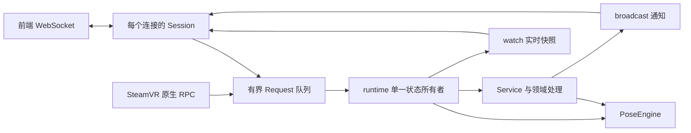

# Rust 后端 API 模块结构

日期：2026-10-07。本次将原来 2,525 行的 `api/mod.rs` 拆成按职责组织的模块。入口只保留 18 行模块声明和公共导出，调用方继续使用 `api::Service`、`api::FrontendConfig`、`api::Request`、`api::Wire`、`api::LiveState` 和 `api::serve`。

## 文件职责

以下路径相对于 `server-rust/crates/slimevr-server/src/api/`。

| 文件 / 目录                    | 职责                                                                 |
| ------------------------------ | -------------------------------------------------------------------- |
| `mod.rs`                       | 声明模块，保持公共入口兼容                                           |
| `config.rs`                    | `FrontendConfig` 默认值、限制校验、调用原有 YAML 读写                |
| `types.rs`                     | 跨任务的请求、响应和只读实时快照类型                                 |
| `transport/mod.rs`             | WebSocket 监听、连接数限制、握手、事件循环和后端信息                 |
| `transport/session.rs`         | 单个连接的 data feed、pub/sub、串口日志和配网订阅；RPC 转交与写出    |
| `service/mod.rs`               | 应用状态、初始化、配置提交、绑定变化后的观测恢复、快照生成           |
| `service/sources.rs`           | 外部追踪来源、SteamVR 头显 / 手柄输入及来源所有权                    |
| `service/notifications.rs`     | SteamVR 自动共享、连接状态和驱动管理结果通知                         |
| `service/calibration.rs`       | 快捷键、延迟暂停、完整 / 航向 / 安装方向重置的计时和进度             |
| `service/devices.rs`           | 串口、配网、固件更新和设备控制的事件协调                             |
| `service/recording.rs`         | AutoBone 保存 / 处理结果和 BVH 录制生命周期                          |
| `service/tick.rs`              | 解算后的检查清单、敲击分配、设备 ID、配置保存和录制采样              |
| `service/legacy.rs`            | 原版 JSON WebSocket 的 `config` / `pos` / `action` 与姿态注入        |
| `service/rpc/mod.rs`           | SolarXR 校验、请求日志、批次限制、串口占用保护、按功能分发和错误返回 |
| `service/rpc/configuration.rs` | 软件与算法设置、身体比例和快捷键请求                                 |
| `service/rpc/trackers.rs`      | 设备批准 / 删除、追踪器分配和磁力计请求                              |
| `service/rpc/calibration.rs`   | 重置、暂停、StayAligned、腿部临时设置和身高校准请求                  |
| `service/rpc/hardware.rs`      | 串口命令、Wi-Fi 配网和固件请求                                       |
| `service/rpc/recording.rs`     | AutoBone 和 BVH 请求                                                 |
| `service/rpc/system.rs`        | 心跳、驱动启用、检查清单、状态、VRChat、overlay 和服务端信息         |

既有 `protocol.rs` 编码、`settings.rs` 转换、`device_control.rs` 控制器、`diagnostics.rs` 检查清单、`status.rs` 状态系统、`vrchat.rs` 平台配置和 `pubsub.rs` 主题注册表继续负责各自的功能。

## Tick 延迟统计

`runtime/timing.rs` 用单调 `Instant` 测量主循环的 tick 起始时间。
每个 `runtime_timing` 汇总包含 `tick_kind`（`pose` 或仅接收模式的
`receiver`）、目标周期、实际窗口长度、tick 数与间隔样本数。

| 字段                                                           | 含义                                                                                                         |
| -------------------------------------------------------------- | ------------------------------------------------------------------------------------------------------------ |
| `tick_jitter_ms`                                               | 相邻 tick 的实际间隔与目标周期之差的绝对值，输出 p50 / p95 / p99 / p999 / max                                |
| `tick_work_ms`                                                 | 一次主循环 tick 的实际耗时，包含状态更新、解算、输出和周期维护，输出同样的分位数；不是单独 PoseEngine 的耗时 |
| `runtime_stall`                                                | 实际间隔超出目标周期的部分，累计统计严格超过 2 / 5 / 10 / 50 / 100 ms 的次数，字段为 `gt_2ms` 等             |
| `udp_queue_delay_ms`                                           | 从 socket 接收后到主循环开始处理的等待时间，包含接收任务解析与队列等待，输出同样的分位数                     |
| `udp_batch_work_ms`                                            | 一次有预算的 UDP 处理实际耗时，包含接收器、effects 和可选 journal 写入，输出同样的分位数                     |
| `udp_datagrams` / `udp_batches` / `udp_budget_yields`          | 本窗口处理的包数、批次数与达到预算而退出批次的次数                                                           |
| `udp_coalesced` / `udp_dropped_poses` / `udp_dropped_controls` | 汇入窗口的队列合并、姿态容量丢包与控制容量丢包数量                                                           |

例如目标周期 4 ms、实际间隔 7 ms，jitter 为 3 ms，stall 只增加
`gt_2ms`；实际间隔 1 ms 时 jitter 同样为 3 ms，但不增加 stall。
一次超过 100 ms 的 stall 同时增加五个阈值计数。首次 tick 没有上一次
起始时间，因此不产生间隔样本；跨汇总窗口的间隔继续计入下一个窗口。
长停顿只记一次实际观测，不虚构被跳过的 tick 样本。

默认窗口为 10 秒，可用 `listen --timing-window-ms 30000` 改成 30 秒。
退出时会补发剩余的部分窗口，空窗口不发。正常汇总为 info；窗口内有
超过 50 ms 的 stall 时为 warn。旧的单条 `runtime_stall` / 100 ms
间隔告警已替换为这些统计。默认 4 ms 周期下，10 秒约有 2,500 个间隔
样本；不足 1,000 个样本时 p999 通常接近最大值，分析时必须同时看
`interval_samples`、`window_ms` 和 `max`。

分位数采用 nearest-rank 与固定大小的微秒直方图，不保存或逐帧排序
原始样本。小于 512 微秒的桶按微秒分辨，之后桶宽不超过约 0.4%；
分位数取桶上界并限制到真实最大值，因此存在最多约 0.4% 加 1 微秒的
量化误差。`max` 和 stall 阈值判断保留原始时钟精度。四个直方图总计
约 456 KiB，内存不随运行时间或窗口长度增加。UDP 合并／丢弃计数按
`--summary-ms` 收集后汇入 timing 窗口，跨越两种窗口边界时可能归入
相邻窗口；退出时补收剩余计数。等待与批处理耗时逐包／逐批计入当前窗口。

## 执行和状态边界

后端的 `main` 使用两个工作线程的 Tokio runtime。`listen` 是由主线程
`block_on` 执行的根 future，不作为可迁移的任务启动，因此 Receiver、
PoseEngine 和 Service 仍由同一个线程按顺序更新。`tokio::spawn` 启动的
WebSocket、SteamVR IPC、OSC 和 UDP 接收任务在两个工作线程上执行；它们
通过已有的有界命令队列、watch 快照和 broadcast 通知与主循环交换数据。
串口和 HID 沿用各自的设备线程，AutoBone 等阻塞计算沿用后台任务。

`runtime/ingress.rs` 独立读取追踪器 UDP，分别限制为 256 个纯姿态数据包
和 128 个控制／其他数据包，共用有序队列。正常接收保留每个样本，供滤波器
使用；纯姿态包等待超过一个配置的 tick 周期，或姿态队列超过容量时，才按
来源地址、传感器编号和数据字段合并积压。旋转、加速度、位置和 flex 分别
判断：只有一个旧包的全部字段都有更新数据覆盖，才能移除这个旧包。

握手、设备状态、配置确认、重置请求、遥测、解析异常，以及混合控制与姿态的
bundle 都保留为完整有序消息。合并不会跨过同一来源的控制消息，也不会跨过
重复／乱序序号或零与非零序号的切换。bundle 不拆写，尚未被覆盖的第二传感器
或加速度不会因另一个字段更新而丢失。接收任务的解析结果随原始字节一起
移交给 Receiver，不再重复解析；保留 BTreeSet / BTreeMap 的覆盖判定，
其开销通过 [队列与 runtime 基准](rust-udp-runtime-performance.zh-CN.md) 验证。

主循环每次最多处理 16 个包或 `min(1ms, tick 周期 / 4)` 的时间，到预算
后返回调度器。剩余包留在原有有界队列中，能够继续被新姿态覆盖，不另建
一份不可合并的积压。单个 datagram / bundle 的 effects 完整处理，不在中间
截断；replay journal 仍记录选中的原始字节。到期 tick 优先于下一批输入；
若一次 tick 本身已超过周期，下一轮先给就绪输入一次机会，避免连续 tick
反而饿死接收端。输入来源之间继续使用公平选择，退出信号保持优先。

这是包边界上的软预算，不能抢占单包处理或操作系统停调；实际超时仍会
出现在 `udp_batch_work_ms` 与 tick jitter 中。

合并后仍超过姿态容量时，淘汰最旧纯姿态包以接纳新包；控制容量独立计数，
控制队列满时丢弃新控制包并报告警告。`udp_ingress_backpressure` 区分正常合并
与实际容量丢包。队列保持有界、不等待消费者，但操作系统收包缓冲区和线程
调度仍可能在满载时丢包，不能保证电脑完全满载时追踪无损。

单个传感器停更仍沿用上游的缓存姿态行为，不增加独立姿态 TTL。上游
[UDPProtocolParser](https://github.com/SlimeVR/SlimeVR-Server/blob/83941fd38e91cc91ca6b360deab5c2ae986dd1b6/server/core/src/main/java/dev/slimevr/tracking/trackers/udp/UDPProtocolParser.kt)
在收到同一设备的数据包时更新其所有传感器的 heartbeat；这不表示每个传感器
都产生了新姿态。Rust 的 `pose_age_ms` / `pose_stale` 仍用于诊断，不改变
缓存姿态参与解算、设备连接和校准的规则。

## 时间与配置更新

UDP 使用同一起始 Instant 的两个时刻：socket 收到包后立即捕获接收时刻，
主循环取包时捕获处理时刻。接收时刻不包含数据在系统 UDP 缓冲区里等待的
时间，也不能作为 tracker 到电脑的网络延迟。

- `Record::Receive.at_ms`、InputEvent 时刻、Timed 数据的旧 `received_at_ms`
  仍表示处理时刻，驱动接收器超时、滤波、校准、敲击和 replay 的单调时钟。
- 录制的可选 `received_at_ms` 与 TrackerSample 的可选 `socket_received_at_ms`
  保存接收时刻。允许它早于之前已经处理的 tick；不得晚于自身处理时刻。
- Receiver 的 freshness 与算法 TrackerPose 的 `pose_age_ms` / `pose_stale`
  对有 socket 时刻的旋转使用真实接收年龄。`pose_processing_age_ms` 保留
  处理年龄，`pose_queue_delay_ms` 表示两时刻之差；Receiver 的
  `udp_rotation_timing` 还保存接收／处理时刻。加速度、另一传感器、重复包
  不会刷新这个旋转时刻。
- 老录制没有新字段时按原来的处理时刻计算诊断。HID / SteamVR / OSC 等
  来源沿用原来的时间，不套用 UDP 排队时间；IMU 缓存可用性不受诊断年龄影响。

PoseEngine 的 `config_revision` 只在配置可能变化时更新，覆盖元数据、
连接／能力变化、重置、安装方向清除、自动身高校准和 configure。Service
在 revision 改变时才调用 `export_config()`，tick 和 API 读取都能看到新配置。
普通姿态样本与 tick 不触发导出。

热键和 OSC 使用各自的 dirty 标志：配置成功提交且相关设置改变后，在下一次
tick 更新相应控制器。热键不再每 4ms 从内存 YAML 解析，OSC 不再每帧克隆
并重配；失败的配置提交不触发更新。SteamVR 自动分享先检查较小的分享配置，
真正改变时才克隆并保存完整配置。

诊断日志由 `slimevr-log-writer` 线程写 stdout / stderr。调用方仍负责
序列化一条 JSON，但不在实时循环里执行管道写入。队列同时限制为 512 条
和 4 MiB（包含正在写的一条），满时丢弃诊断日志，写入恢复后报告
`logging_backpressure` 及丢弃数量。正常退出会排空队列；管道一直堵塞时，
退出最多等两秒，避免被日志消费者拖住。错误和警告仍走 stderr。

这次没有异步化配置提交、UDP replay journal 和 BVH 文件写入。这些输出
需要保持成功确认与持久化的关系，不能沿用诊断日志的丢弃策略；下一步应
使用独立、有序的文件工作队列，并把写入结果送回状态所有者。

`Session` 持有连接自己的订阅、发送状态和主题身份，不持有 `PoseEngine`。领域处理仍通过同一个 `Service` 修改配置、记录场景变化和协调控制器；这些调用在原来的 runtime 循环内执行。拆分不新增算法状态锁，不改变 UDP 接收或解算调度，也不把每种 RPC 变成独立异步任务。

`Service` 的内部字段保留在 `service/mod.rs`，其他文件通过同一类型的 `impl Service` 实现对应职责。跨领域的私有方法仅在 `service` 范围可见，连接侧订阅状态则由独立的 `Session` 结构体封装。

## 保留的通信行为

- SolarXR FlatBuffers、旧 JSON WebSocket 和原生 RPC 的公开类型及字段保持兼容。
- 请求按批次内原顺序执行，直接响应保留事务号；异步广播继续走原来的事件通道。
- 批次上限仍为 32。超量批次在执行前拒绝；普通批次某条请求失败时，停止后续请求，已经执行的操作保留，返回错误和当前设置。
- 连接上限、帧大小、握手 / RPC / 发送超时以及 data feed 最小间隔不变。
- pub/sub 的订阅按连接隔离，排除向发送者回送；串口和配网通知按连接订阅过滤。
- 原配置文件、校准计时、AutoBone / BVH 保存和此前的 UDP 重连校准修复继续生效。

## 修改入口与验证

新增 RPC 时，在 `service/rpc/mod.rs` 注册所属领域，并在对应领域文件中实现；请求校验和错误包装保留在统一入口。修改设置转换优先看 `settings.rs`；修改具体协议编码优先看 `protocol.rs`；修改 UDP 或算法行为仍分别进入接收层和 `slimevr-core`。

本次补充了三项跨领域批次契约测试，在拆分前后的实现上均通过，覆盖响应顺序 / 事务号、广播和 YAML 保存、失败后的执行边界、超量批次无副作用。两项真实 WebSocket 测试覆盖连接初始化、心跳、轮询和定时 data feed，以及多连接 pub/sub 隔离和发送者排除。

最终验证：126 项后端测试通过；格式检查及 Linux / Windows x64 目标的全目标 Clippy（`-D warnings`）通过。六设备 UDP / WebSocket / SteamVR Unix IPC 模拟联调对照拆分前后的正常、头显中断、头显恢复和后端停顿重连四个阶段，旋转、计算点位、校准标记和会话号逐项一致。这些检查不替代 Windows / SteamVR 实机验收。
