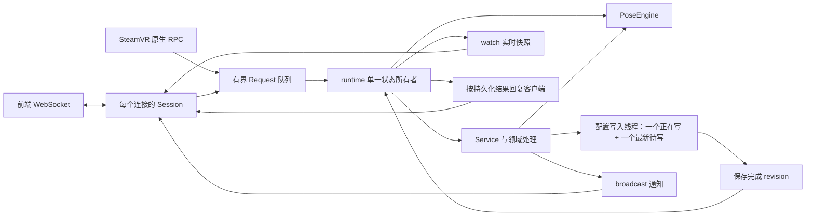

# 后端 API、通信与 runtime

API 按配置、传输连接、应用状态和领域请求组织模块。`api/mod.rs` 声明模块并导出公共类型，调用方使用 `api::Service`、`api::FrontendConfig`、`api::Request`、`api::Wire`、`api::LiveState` 和 `api::serve`。

## 文件职责

以下路径相对于 `server-rust/crates/slimevr-server/src/api/`。

| 文件 / 目录                    | 职责                                                                 |
| ------------------------------ | -------------------------------------------------------------------- |
| `mod.rs`                       | 声明模块，保持公共入口兼容                                           |
| `config.rs`                    | `FrontendConfig` 默认值、限制校验、调用原有 YAML 读写                |
| `types.rs`                     | 跨任务的请求、响应和只读实时快照类型                                 |
| `transport/mod.rs`             | WebSocket 监听、连接数限制、握手、事件循环和后端信息                 |
| `transport/session.rs`         | 单个连接的 data feed、pub/sub、串口日志和配网订阅；RPC 转交与写出    |
| `service/mod.rs`               | 应用状态、初始化、配置提交、绑定变化后的观测恢复、快照生成           |
| `service/sources.rs`           | 外部追踪来源、SteamVR 头显 / 手柄输入及来源所有权                    |
| `service/notifications.rs`     | SteamVR 自动共享、连接状态和驱动管理结果通知                         |
| `service/calibration.rs`       | 快捷键、延迟暂停、完整 / 航向 / 安装方向重置的计时和进度             |
| `service/devices.rs`           | 串口、配网、固件更新和设备控制的事件协调                             |
| `service/recording.rs`         | AutoBone 保存 / 处理结果和 BVH 录制生命周期                          |
| `service/tick.rs`              | 解算后的检查清单、敲击分配、设备 ID、配置保存和录制采样              |
| `service/legacy.rs`            | 原版 JSON WebSocket 的 `config` / `pos` / `action` 与姿态注入        |
| `service/rpc/mod.rs`           | SolarXR 校验、请求日志、批次限制、串口占用保护、按功能分发和错误返回 |
| `service/rpc/configuration.rs` | 软件与算法设置、身体比例和快捷键请求                                 |
| `service/rpc/trackers.rs`      | 设备批准 / 删除、追踪器分配和磁力计请求                              |
| `service/rpc/calibration.rs`   | 重置、暂停、StayAligned、腿部临时设置和身高校准请求                  |
| `service/rpc/hardware.rs`      | 串口命令、Wi-Fi 配网和固件请求                                       |
| `service/rpc/recording.rs`     | AutoBone 和 BVH 请求                                                 |
| `service/rpc/system.rs`        | 心跳、驱动启用、检查清单、状态、VRChat、overlay 和服务端信息         |

既有 `protocol.rs` 编码、`settings.rs` 转换、`device_control.rs` 控制器、`diagnostics.rs` 检查清单、`status.rs` 状态系统、`vrchat.rs` 平台配置和 `pubsub.rs` 主题注册表继续负责各自的功能。

## Tick 延迟统计

`runtime/timing.rs` 用单调 `Instant` 测量主循环的 tick 起始时间。
每个 `runtime_timing` 汇总包含 `tick_kind`（`pose` 或仅接收模式的
`receiver`）、目标周期、实际窗口长度、tick 数与间隔样本数。

| 字段                                                                                              | 含义                                                                                                       |
| ------------------------------------------------------------------------------------------------- | ---------------------------------------------------------------------------------------------------------- |
| `tick_jitter_ms`                                                                                  | 相邻 tick 的实际间隔与目标周期之差的绝对值，输出 p50 / p95 / p99 / p999 / max                              |
| `tick_work_ms`                                                                                    | 一次主循环 tick 的实际耗时，包含状态更新、解算、输出和周期维护，输出同样的分位数；测量范围为完整 tick 路径 |
| `runtime_stall`                                                                                   | 实际间隔超出目标周期的部分，累计统计严格超过 2 / 5 / 10 / 50 / 100 ms 的次数，字段为 `gt_2ms` 等           |
| `udp_queue_delay_ms`                                                                              | 从 socket 接收后到主循环开始处理的等待时间，包含接收任务解析与队列等待，输出同样的分位数                   |
| `udp_batch_work_ms`                                                                               | 一次有预算的 UDP 处理实际耗时，包含接收器、effects 和可选 journal 写入，输出同样的分位数                   |
| `udp_datagrams` / `udp_batches` / `udp_budget_yields`                                             | 本窗口处理的包数、批次数与达到预算而退出批次的次数                                                         |
| `udp_coalesced` / `udp_dropped_poses` / `udp_dropped_controls`                                    | 汇入窗口的队列合并、姿态容量丢包与控制容量丢包数量                                                         |
| `api_live_snapshot_ms` / `api_live_snapshots`                                                     | `Service::live()` 构造共享快照的耗时分位数与调用次数，计时从构造开始到返回结束                             |
| `steamvr_output_batches_enqueued` / `steamvr_output_batches_written`                              | 主循环成功入队批次与 IPC 写完全部消息的批次，二者分别计数                                                  |
| `steamvr_output_queue_full` / `steamvr_output_queue_closed`                                       | `try_send` 因队列满或接收端关闭而失败的次数                                                                |
| `steamvr_output_write_failed` / `steamvr_output_write_cancelled` / `steamvr_output_stale_batches` | 编码／写入／超时失败、发送 future 被连接结束取消、重连后丢弃旧会话批次                                     |

例如目标周期 4 ms、实际间隔 7 ms，jitter 为 3 ms，stall 只增加
`gt_2ms`；实际间隔 1 ms 时 jitter 同样为 3 ms，stall 为 0。
一次超过 100 ms 的 stall 同时增加五个阈值计数。间隔样本从第二次 tick 开始；跨汇总窗口的间隔继续计入下一个窗口。
长停顿按一次实际观测计入窗口。

默认窗口为 10 秒，可用 `listen --timing-window-ms 30000` 改成 30 秒。
退出时补发包含剩余样本的部分窗口。正常汇总为 info；窗口内有
超过 50 ms 的 stall，或 SteamVR 队列满／关闭／写入失败时为 warn。调度诊断以这些窗口统计报告。默认 4 ms 周期下，10 秒约有 2,500 个间隔
样本；不足 1,000 个样本时 p999 通常接近最大值，分析时必须同时看
`interval_samples`、`window_ms` 和 `max`。

分位数采用 nearest-rank 与固定大小的微秒直方图，按桶累计样本。小于 512 微秒的桶按微秒分辨，之后桶宽不超过约 0.4%；
分位数取桶上界并限制到真实最大值，因此存在最多约 0.4% 加 1 微秒的
量化误差。`max` 和 stall 阈值判断保留原始时钟精度。五个直方图总计
约 570 KiB，内存容量固定。UDP 合并／丢弃计数按
`--summary-ms` 收集后汇入 timing 窗口，跨越两种窗口边界时可能归入
相邻窗口；退出时补收剩余计数。等待与批处理耗时逐包／逐批计入当前窗口。

### 快照、保存与 SteamVR 输出诊断

主循环约每 10ms 到期后调用 `Service::live()`。完整配置（含 YAML）采用
`SharedConfig` 的 `Arc` 写时复制，PoseEngine 发布不可变 `Arc<PoseSnapshot>`；
普通 API 发布增加配置与姿态的共享引用计数。设备元数据按
设备缓存，名称、握手、会话、地址或固件日期改变时才替换；每帧复制传感器读数、电量和信号等动态数据到紧凑数组，Receiver 持有 ACK、请求与 ping 的内部状态。小型外部追踪表与 SteamVR 状态仍按值复制。每个已发布帧保留其构造时的配置、设备与姿态状态，SolarXR 与旧 JSON 的线上字段保持兼容。

`api_live_snapshot_ms` 从快照构造开始计时，到函数返回结束；watch 发布与旧值析构由后续路径执行。runtime 窗口只采集运行阶段快照；没有 API 时次数为 0、分位数为 null。
实际调用次数决定 p999 的样本量，应结合 `api_live_snapshots` 判断样本量。

运行期配置持久化由独立的 `slimevr-config-writer` OS 线程执行，包含 YAML
构造、序列化、读取比较、备份、临时文件写入、`sync_all()` 和原子替换。
主循环先验证并应用内存配置，再提交共享配置引用。工作队列最多保留一个
正在写的版本和一个最新待写版本；连续修改以完整的新版本覆盖待写旧版本，
由同一线程顺序写入。取走配置后释放队列锁，再执行文件操作。主循环通过原子完成标志决定是否获取结果锁。

产生配置保存的客户端请求暂存回复，主循环继续解算；完成结果覆盖请求的
保存 revision 后才回复成功。最多暂存 32 个回复，达到上限的新请求返回错误。
合并后较新的完整配置落盘可以确认较早的保存请求。广播反映当前内存状态，
按内存状态即时发布；保存失败通过现有错误通知和日志报告，相关请求返回错误，
内存设置保持已应用状态。纯读取与内存模式直接回复。
正常退出停止 tick 后异步等待写入线程排空，并报告最后一次写入失败。
完整保存需要正常退出并等待写入完成；客户端请求仍受其超时规则约束。

持久配置保存每次实际执行产生 `config_save_timing`，包括验证、YAML 构造与
序列化、文件操作及其内部 `sync_all()` 耗时。`outcome` 为 saved / unchanged /
error；`files_written` 是成功写完并替换的文件数，`sync_all_calls` 是同步
尝试数，包含 `.bak` 与正式文件。后台保存还带 `background: true`、`revision`
和 `queue_delay_ms`（进入待写队列到开始执行）；`total_ms` 从后台实际开始保存时计量。
阶段字段为 `total_ms`、`validation_ms`、`serialization_ms`、`file_io_ms`、`sync_all_ms` 和 `serialized_bytes`；`sync_all_ms` 是 `file_io_ms` 的子阶段。正常保存为 info，超过 4 ms 或失败为 warn。
相同内容执行验证、序列化与读取比较后返回 unchanged。持久路径上的实际保存生成此记录，字段包含阶段耗时、字节数、结果与错误类别。
启动加载及初始保存仍在追踪开始前同步完成，初次保存记录在 listening 后
补发。离线工具的 `FrontendConfig::save()` 仍是同步接口。

SteamVR 主循环保留容量为 4 的队列和非阻塞 `try_send`，只有入队成功才确认
共享状态并清除 ready。原子计数在每个 timing 窗口取走一次；IPC 线程记录
整批消息完成写入的时刻，计数跨重连保留至窗口采集。入队与写完可能跨窗口，各项计数独立读取，分析丢帧时需结合窗口边界和实际输出日志。written 表示整个批次写入 IPC 成功，客户端消费与显示由 SteamVR / VRChat 的后续链路完成。失败与
取消可能已经写出部分消息；旧会话批次继续丢弃。这些计数的范围为驱动输出通道。

阶段耗时使用墙钟时间，包含系统抢占。定位长尾时结合各阶段指标、线程调度和同一时段的日志。

## 执行和状态边界

后端的 `main` 使用两个工作线程的 Tokio runtime。`listen` 是由主线程 `block_on` 执行的根 future，Receiver、PoseEngine 和 Service 由该线程按顺序更新。`tokio::spawn` 启动的
WebSocket、SteamVR IPC、OSC 和 UDP 接收任务在两个工作线程上执行；它们
通过已有的有界命令队列、watch 快照和 broadcast 通知与主循环交换数据。
串口和 HID 沿用各自的设备线程，AutoBone 等阻塞计算沿用后台任务。

`runtime/ingress.rs` 独立读取追踪器 UDP，分别限制为 256 个纯姿态数据包
和 128 个控制／其他数据包，共用有序队列。正常接收保留每个样本，供滤波器
使用；纯姿态包等待超过一个配置的 tick 周期，或姿态队列超过容量时，才按
来源地址、传感器编号和数据字段合并积压。旋转、加速度、位置和 flex 分别
判断：只有一个旧包的全部字段都有更新数据覆盖，才能移除这个旧包。

握手、设备状态、配置确认、重置请求、遥测、解析异常，以及混合控制与姿态的
bundle 都保留为完整有序消息。控制消息、重复 / 乱序序号及零 / 非零切换形成合并边界。bundle 保持完整；字段覆盖检查按第二传感器和加速度分别判断。接收任务将原始字节与解析结果一起移交 Receiver，接收器直接使用该结果；保留 BTreeSet / BTreeMap 的覆盖判定，
其开销通过 [队列与 runtime 基准](rust-udp-runtime-performance.zh-CN.md) 验证。

主循环每次最多处理 16 个包或 `min(1ms, tick 周期 / 4)` 的时间，到预算
后返回调度器。剩余包留在原有有界队列中，可以继续参与新姿态覆盖判断。单个 datagram / bundle 的 effects 完整处理；replay journal 仍记录选中的原始字节。到期 tick 优先于下一批输入；
若一次 tick 本身已超过周期，下一轮先给就绪输入一次机会，使接收与 tick 均有执行机会。输入来源之间继续使用公平选择，退出信号保持优先。

软预算在包边界检查，单包处理与线程停调可能使批次超过预算，实际超时会
出现在 `udp_batch_work_ms` 与 tick jitter 中。

合并后仍超过姿态容量时，淘汰最旧纯姿态包以接纳新包；控制容量独立计数，
控制队列满时丢弃新控制包并报告警告。`udp_ingress_backpressure` 区分正常合并
与实际容量丢包。队列以固定容量接纳输入，满载时的实际丢包还取决于系统 UDP 缓冲区与线程调度。

`udp_ingress_backpressure` 按 `--summary-ms` 汇总 `coalesced`、`dropped_poses` 和 `dropped_controls`，分别表示完整覆盖合并、姿态容量淘汰和控制容量丢弃。只有合并时为 debug，容量丢包时为 warn。计数范围是应用接收队列；系统 UDP 缓冲区丢包由系统指标测量。

设备快照的 `sequence_gaps` 记录接收器观察到的序号间隔，包含主动合并的旧包，需要结合队列计数判断来源。

单个传感器停更沿用上游的缓存姿态可用性规则。上游
[UDPProtocolParser](https://github.com/SlimeVR/SlimeVR-Server/blob/83941fd38e91cc91ca6b360deab5c2ae986dd1b6/server/core/src/main/java/dev/slimevr/tracking/trackers/udp/UDPProtocolParser.kt)
在收到同一设备的数据包时更新其所有传感器的 heartbeat；heartbeat 表示传输活跃。`pose_age_ms` / `pose_stale` 按单个传感器的旋转时间计算诊断，解算可用性、设备连接和校准由各自状态规则决定。

## 时间与配置更新

UDP 使用同一起始 Instant 的两个时刻：socket 收到包后立即捕获接收时刻，
主循环取包时捕获处理时刻。接收时刻的测量边界从 socket 读取完成后开始；网络延迟和系统 UDP 缓冲区等待需由相应测量记录。

- `Record::Receive.at_ms`、InputEvent 时刻、Timed 数据的旧 `received_at_ms`
  仍表示处理时刻，驱动接收器超时、滤波、校准、敲击和 replay 的单调时钟。
- 录制的可选 `received_at_ms` 与 TrackerSample 的可选 `socket_received_at_ms`
  保存接收时刻。允许它早于之前已经处理的 tick；有效值小于或等于自身处理时刻。
- Receiver 的 freshness 与算法 TrackerPose 的 `pose_age_ms` / `pose_stale`
  对有 socket 时刻的旋转使用真实接收年龄。`pose_processing_age_ms` 保留
  处理年龄，`pose_queue_delay_ms` 表示两时刻之差；Receiver 的
  `udp_rotation_timing` 还保存接收／处理时刻。加速度、另一传感器、重复包
  分别更新其对应数据的时刻，旋转时刻由有效旋转样本更新。
- 老录制没有新字段时按原来的处理时刻计算诊断。HID / SteamVR / OSC 等来源使用各自时间语义；IMU 缓存可用性由状态规则决定。

PoseEngine 的 `config_revision` 只在配置可能变化时更新，覆盖元数据、
连接／能力变化、重置、安装方向清除、自动身高校准和 configure。Service
在 revision 改变时才调用 `export_config()`，tick 和 API 读取都能看到新配置。
普通样本与 tick 使用当前 revision 对应的配置。

热键和 OSC 使用各自的 dirty 标志：配置成功提交且相关设置改变后，在下一次
tick 更新相应控制器。配置验证成功且对应 dirty 标志置位时解析热键或重配 OSC；后台落盘失败保留已应用的控制器设置。SteamVR 自动分享先检查较小的分享配置，
真正改变时才克隆并保存完整配置。

诊断日志由 `slimevr-log-writer` 线程写 stdout / stderr。调用方仍负责
序列化一条 JSON，序列化结果进入有界队列，再由写入线程操作管道。队列同时限制为 512 条
和 4 MiB（包含正在写的一条），满时丢弃诊断日志，写入恢复后报告
`logging_backpressure` 及丢弃数量。正常退出会排空队列；管道一直堵塞时，
退出最多等两秒，随后按当前退出流程结束。错误和警告仍走 stderr。

UDP replay journal 和 BVH 文件写入仍在原来的路径上；配置保存使用独立、有序的文件队列与持久化完成反馈。



`Session` 持有连接的订阅、发送状态和主题身份。runtime 持有 PoseEngine，Service 在同一状态线程中修改配置、记录场景变化和协调控制器。领域 RPC 按请求顺序调用，网络任务通过队列与状态所有者交互。

`Service` 的内部字段保留在 `service/mod.rs`，其他文件通过同一类型的 `impl Service` 实现对应职责。跨领域的私有方法仅在 `service` 范围可见，连接侧订阅状态则由独立的 `Session` 结构体封装。

## 通信契约

- SolarXR FlatBuffers、旧 JSON WebSocket 和原生 RPC 的公开类型及字段保持兼容。
- 请求按批次内原顺序执行，直接响应保留事务号；异步广播继续走原来的事件通道。
- 批次上限仍为 32。超量批次在执行前拒绝；普通批次某条请求在验证或执行时失败，停止后续请求，已经执行的操作保留，返回错误和当前设置。后台保存失败在批次执行后反馈，已执行操作保持其内存状态。
- 连接上限、帧大小、握手 / RPC / 发送超时及 data feed 最小间隔由 transport 配置统一校验。
- pub/sub 的订阅按连接隔离，排除向发送者回送；串口和配网通知按连接订阅过滤。
- 原配置文件、校准计时、AutoBone / BVH 保存和UDP 重连校准按会话策略执行。

## 前端连接与通知

React / Tauri、GPUI 和仪表盘共用 SolarXR FlatBuffers 及生成绑定。`backend_info` 提供能力和连接信息，`backend_error` 提供操作错误，`backend_file_saved` 提供 BVH 保存结果；数据和 RPC 使用二进制 SolarXR，直接响应保留事务号，实时状态变化向连接广播。

WebSocket 最多 16 个客户端，每个客户端最多 8 个订阅，输入消息上限 8 MiB，订阅最短间隔 10 ms。React 默认约 10 Hz 设备数据和 40 Hz 骨架；GPUI 刷新规则见 [GPUI 指南](rust-gpui-guide.zh-CN.md#组件和生成数据)。核心默认每 4 ms 解算，发布与日志频率分别控制。慢客户端通过最新快照、发送超时和有界事件队列处理。

分配为新绑定恢复最近样本并保留原始接收时间；普通设置修改保留其他绑定的运行校准。骨架预览发送约束后的 FK，11 个计算追踪器使用最终后处理位置与方向。设置转换入口为 `settings.rs`，编码与订阅掩码入口为 `protocol.rs`。

### 连接与分配页面生命周期

每个 WebSocket 连接持有并清理自己的监听器。回调根据连接身份和组件生命周期判断有效性，当前连接事件更新当前状态。界面依据断开码、原因与超时提示连接状态。后端连接任务失败产生 `api_connection_error`，包含客户端编号、地址与原因；对应连接结束后其他客户端和接收器继续运行。

分配页面按挂载、卸载与连接恢复切换敲击分配模式，写入请求只包含 `setupMode`。其他敲击参数以服务端当前值为准；SettingsResponse 更新读取状态。断开连接后的卸载按连接状态清理，恢复连接后按当前页面重建分配模式。稳定页面维持当前模式。

重置进度遵循 `ResetTimer.kt` 的整秒规则，每个整秒通知一次，完成进度等于设定倒计时时长。前端按操作、阶段和秒数去重。GPUI 播放由独立音频线程执行，React / Tauri 使用原声音素材与进度处理。

自动检查覆盖连接事件竞态、卸载、错误序列化、非法帧，以及真实网页在分配页停留、离页、重新进入、断线恢复和参数保留。实机按 [统一清单](rust-unified-hardware-test.zh-CN.md) 验收。

### 外部姿态注入

SteamVR 驱动协议 2 的头显/控制器输入和计算追踪器输出已接入，Linux/Windows API 模式默认启用，详见 [SteamVR 桥接说明](rust-steamvr-bridge.zh-CN.md)。也保留独立的 WebSocket 文本输入，时间由服务端单调时钟分配；单位为米，使用核心坐标 `+X` 右、`+Y` 上、`+Z` 后：

```json
{"type":"pose_input","body":"head","rotation":{"w":1,"x":0,"y":0,"z":0},"position":{"x":0,"y":1.7,"z":0}}
{"type":"pose_input","body":"left_hand","rotation":{"w":1,"x":0,"y":0,"z":0},"position":{"x":-0.3,"y":1.1,"z":-0.4}}
{"type":"pose_clear","body":"left_hand"}
```

支持 `head`、`left_hand`、`right_hand`。外部源使用虚拟设备 ID 0，真实 UDP 设备使用 1..254；传感器编号 0 在 GUI 中也可正常查找。停止外部源时桥应发送 `pose_clear`。普通 UDP 提供相对骨架，世界位置锚定和 AutoBone 训练使用外部 HMD 位置；测眼高还需要控制器位置。测眼高的有效 HMD 高度范围保持核心的 1.2..1.936 m。

前端消息分发和订阅入口为 `gui/src/hooks/websocket-api.ts`、`gui/src/platform/solarxr.ts`。宿主启动与退出由 `gui/src-tauri/src/server.rs` 管理，参数见 [Tauri README](../gui/README.tauri.md)。

## 修改入口与验证

新增 RPC 时，在 `service/rpc/mod.rs` 注册所属领域，并在对应领域文件中实现；请求校验和错误包装保留在统一入口。修改设置转换优先看 `settings.rs`；修改具体协议编码优先看 `protocol.rs`；修改 UDP 或算法行为仍分别进入接收层和 `slimevr-core`。

自动检查覆盖批次响应顺序与事务号、广播、YAML 保存、失败执行边界和超量批次校验。`pnpm --dir gui test:backend` 使用真实 Rust CLI、六个 UDP socket、WebSocket 和 TypeScript 绑定，检查准入、sensor 0、分配、命名、重置、设置、临时腿部参数、删除、重启保存及在线 / 回放一致性。先构建 debug 后端，或用 `SLIMEVR_RUST_BINARY` 指定可执行文件。真实 WebSocket 用例覆盖初始化、心跳、轮询、定时 feed、多连接 pub/sub 隔离与发送者排除。共享快照与慢磁盘测试检查已发布帧稳定性、配置合并、持久化回复和退出排空。

六设备 UDP / WebSocket / SteamVR Unix IPC 模拟联调覆盖正常、HMD 中断 / 恢复和后端停顿重连。CI 在 Linux / Windows 执行检查；真实 SteamVR、管道、追踪品质和 CPU 竞争按 [实机清单](rust-unified-hardware-test.zh-CN.md) 记录。
