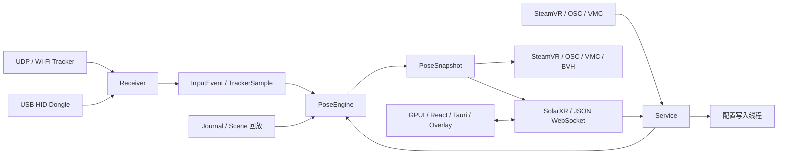

# Rust 后端结构与开发指南

后端由接收层、算法核心和前端通信层组成。源码参考 SlimeVR Server `83941fd38e91cc91ca6b360deab5c2ae986dd1b6`，兼容现有 Tracker 四元数协议、SolarXR schema 和 OpenVR Driver。运行与构建见 [后端 README](../server-rust/README.zh-CN.md)。

## 数据链路



## 模块职责

| 位置                                                                    | 职责                                                       |
| ----------------------------------------------------------------------- | ---------------------------------------------------------- |
| `crates/slimevr-core/src/lib.rs`                                        | 四元数、向量、设备身份、TrackerSample 与 InputEvent        |
| `slimevr-core/src/pose.rs`                                              | 姿态状态所有权、采样、tick、校准、配置 revision 和共享快照 |
| `slimevr-core/src/math.rs`、`calibration.rs`、`filtering.rs`            | 数学兼容操作、Full / Yaw / Mounting reset 与滤波           |
| `slimevr-core/src/skeleton.rs`、`constraints.rs`                        | 全身 FK、扩展模型、缺失来源回退、骨长与关节约束            |
| `slimevr-core/src/legs.rs`、`alignment.rs`、`localizer.rs`              | 脚部后处理、相对航向对齐与根位置估计                       |
| `slimevr-core/src/autobone.rs`、`gestures.rs`、`flex.rs`、`velocity.rs` | 比例拟合、敲击和身高校准、手指 flex、派生线速度            |
| `slimevr-server/src/protocol.rs`、`receiver.rs`、`receiver/`            | UDP 字节解析、设备与传感器会话、HID 和外部来源             |
| `slimevr-server/src/runtime.rs`、`runtime/`                             | 输入调度、UDP 有界合并、tick 预算、保存完成回复和性能统计  |
| `slimevr-server/src/api/`                                               | 配置、连接 Session、只读快照、领域 RPC、检查清单与 pub/sub |
| `slimevr-server/src/config.rs`、`config/`                               | YAML 加载和迁移、保留未知字段、后台顺序保存与原子替换      |
| `slimevr-server/src/steamvr/`、`osc/`                                   | SteamVR IPC、OSC / OSCQuery / VMC 输入输出                 |
| `slimevr-server/src/serial/`、`firmware.rs`、`hid.rs`                   | 配网、设备控制、固件下载 / 刷写与 USB 接收器               |
| `slimevr-server/src/recording.rs`、`pose_recording.rs`、`bvh.rs`        | 原始事件 journal、AutoBone 文件与动画导出                  |
| `tests/fixtures/`、`tools/`、`benchmarks/`                              | 协议与算法参考、生成器、性能基准和测量数据                 |

表中 `slimevr-core/` 和 `slimevr-server/` 均位于 `server-rust/crates/`。具体 API 文件导航和线程边界见 [后端 API 架构](rust-backend-api-architecture.zh-CN.md)。

## 接收契约

设备身份、网络地址、sensor ID 和前端数字 ID 分别管理。一台设备可以包含多个传感器。普通 UDP 头使用大端编码，bundle 和 compact bundle 按各自的长度与类型字段解析。固件版本保留字符串形式，准入与协议处理使用握手字段和设备能力。

接收层保存原始值和统一坐标值。方向使用 `q_server = q_axes × q_packet`，其中 `q_axes` 绕 X 轴旋转 `−π/2`；加速度按协议版本选择转换。身体安装方向和航向修正由算法校准层执行，板端 `IMU_ROTATION` 由固件处理。

UDP 在 socket 读取后记录接收时刻，在主循环处理时记录处理时刻。接收时刻用于姿态年龄与排队诊断，处理时刻驱动状态机、滤波和 journal 回放。设备提供的采样时刻单独保存；缺失时标记为未知。

正常接收向滤波器提供每个样本。积压超过 tick 周期或姿态容量时，队列根据来源、sensor 和数据字段的完整覆盖关系合并旧纯姿态包；控制消息保持完整顺序。主循环按 datagram 边界执行时间和包数预算。具体容量、序号边界和诊断见 [runtime 架构](rust-backend-api-architecture.zh-CN.md#执行和状态边界)。

设备心跳表示传输活跃，单个传感器的 `pose_age_ms` 表示旋转年龄。缓存姿态的解算可用性遵循上游状态规则。电量、RSSI、温度和延迟使用实际报告值，缺失值保持未知。

## 算法契约

核心使用 f32 和 `{w,x,y,z}` 四元数，输入位置以米为单位，坐标为 `+X` 右、`+Y` 上、`+Z` 后。Tracker 的方向为全局方向；子骨位置继承父骨尾端，方向由当前骨的输入与回退规则确定。

算法链路为校准 / 滤波、FK 与约束、LegTweaks、StayAligned、Localizer 和最终快照。`skeleton.bones` 表示约束后的 FK，`skeleton.computed` 表示最终计算追踪器输出。姿态采样与解算 tick 分别推进；Localizer 的根位置修正在下一帧 FK 体现。

普通 FK 使用其固定调用链。`usePosition` / `correctConstraints` 作为兼容配置保存，通用 IK 和 tracker 约束反馈的执行范围以 [算法 README](../server-rust/README.core.zh-CN.md) 为准。

Full / Yaw / Mounting reset 的左右乘、过渡、延迟和滤波初始化按参考行为执行。已知 UDP 设备重新握手时保留校准，接收会话和动态历史重新建立。设备实际重启或佩戴变化后由使用者重新校准。

AutoBone 使用校准后的未滤波输入和跨帧训练骨架，按录制配置保留约束并绕过 LegTweaks。结果包含累计训练误差、最终骨长的重新评估误差和接受状态。应用和导出要求结果通过接受阈值。见 [校准与训练契约](rust-calibration-autobone.zh-CN.md)。

## 配置、输出与前端

后端配置保存在原版 `vrconfig.yml` / `.yaml`。版本迁移、平台路径、字段映射和未知字段保留见 [配置说明](rust-config-compatibility.zh-CN.md)。配置 revision 驱动导出，hotkey 和 OSC 的 dirty 标志驱动重配。运行期保存由单个 OS 线程顺序执行，客户端成功回复等待对应 revision 落盘。

SteamVR 输出使用有界非阻塞队列，IPC 完成写入和队列满分别计数。世界坐标输出要求有效锚点。OSC / VMC、BVH 和 AutoBone 文件各自使用其格式与生命周期。原始 journal 保存接收字节、实际 tick、控制和回复意图，用于状态重建。

GPUI、Tauri、浏览器和仪表盘面板共用 SolarXR / FlatBuffers。连接 Session 管理订阅，Service 按批次顺序执行领域请求。前端重连恢复读取和订阅，用户操作在当前连接会话内确认。旧 JSON WebSocket 的 `config` / `pos` / `action` 共用监听端口。

## 开发与验证

修改接收协议时核对字节、坐标、身份、序号和会话；修改算法时核对阶段输出、持续状态与参考容差；修改 RPC 时核对事务号、广播、批次失败边界和持久化反馈。受影响的文档与注释直接描述最终接口与行为。

```sh
cargo test --manifest-path server-rust/Cargo.toml --workspace --locked
cargo clippy --manifest-path server-rust/Cargo.toml --workspace --all-targets --locked -- -D warnings
cargo fmt --manifest-path server-rust/Cargo.toml -p slimevr-core -p slimevr-server -- --check
```

普通测试读取 golden fixtures；参考重建使用固定的 Java / Kotlin 源码与可控时钟。参考覆盖、物理单位容差和统计结果见 [核心验证](rust-core-validation.zh-CN.md)。UDP、共享快照和 CPU 竞争基准见 [性能验证](rust-udp-runtime-performance.zh-CN.md)。

实机验收优先使用胸、髋、双大腿、双小腿与 VR 控制器的六点布局，记录设备 / sensor / 身体部位映射。检查 HMD 世界锚点、左右佩戴、脚方向回退、重置、转身、蹲坐、断网、热机和 CPU 竞争。串口、OTA、HID 及平台功能按实际硬件验收，见 [统一测试清单](rust-unified-hardware-test.zh-CN.md)。

## 输入与扩展范围

当前服务处理已有固件的融合四元数与姿态协议。设备侧负责 IMU 采样、融合及设备校准；服务端负责安装 / 航向校准、人体解算、接触修正和相对对齐。六轴重力观测约束倾斜，绝对 yaw 需要相应参考。

raw IMU 协议、Server-side VQF、设备时钟同步、长期温漂学习、Deep Static、ML、Android 宿主和常驻 daemon 属于独立设计项目。现有桌面宿主按自己的后端所有权管理退出。设备资料与证据范围见 [设备基线说明](rewrite-reference-review.zh-CN.md)。
