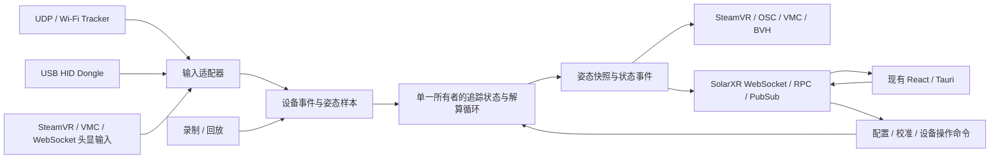

# SlimeVR Java/Kotlin 后端 Rust 重写计划

> 当前实施已进入集中实机验收；本文件保留计划和阶段历史。最新状态见 [实施交接](rust-completion-worklog.zh-CN.md) 与 [实机测试清单](rust-unified-hardware-test.zh-CN.md)。

日期：2026-10-03。源码基线：`83941fd38e91cc91ca6b360deab5c2ae986dd1b6`，SolarXR 子模块沿用该提交锁定的版本。

**迁移顺序按本次讨论确定：数据接收端 → 核心算法 → 前端通信。** 前两个阶段使用命令行、录制文件和差分报告验收，第三阶段接入现有 React/Tauri 页面。UDP 接收端与算法核心首批已经实现，代码、验证与待办见第 11、12 节。

默认以现有协议、配置和正常输入下的行为兼容为目标；首个可使用版本建议优先 Windows，并保持 Linux/macOS 的跨平台边界。平台优先级与历史兼容范围尚可调整，不影响从 UDP 接收开始的顺序。

2026-10-03 资料包复核补充：已对照用户提供的 `SlimeVR_rewrite_bundle_2026-09-30.zip`。本轮只补充设备基线、兼容细节和验收要求；新 raw IMU 协议、融合上移、固件重写、长期自校准、Deep Static、ML 以及常驻 daemon 生命周期改造均暂缓。下文架构与目录分层仍是草案，不视为已批准实施。具体差异见[资料对照补充说明](rewrite-reference-review.zh-CN.md)。

## 1. 最终目标与已有基础

最终交付一个可以独立运行的 Rust SlimeVR 服务，覆盖桌面后端的数据接收、人体解算、校准、配置、录制、设备管理、输出桥接及 GUI API。Tauri 负责窗口、托盘、原生对话框和进程生命周期，复用现有前端；发布版后端不依赖 JVM。

继续使用现有 Tracker 固件、SolarXR schema 和 OpenVR Driver。Driver、Bindings Provider、固件以及设备工具属于独立组件，需要兼容其接口和打包依赖；用 Rust 重写服务不意味着这些组件自动被替换。

现有仓库中可以直接利用的部分：

| 基础                                  | 用途                                                 |
| ------------------------------------- | ---------------------------------------------------- |
| `gui/src/platform/`、`gui/src-tauri/` | 已适配的桌面宿主，最后接入新后端                     |
| `solarxr-protocol/protocol/rust/`     | 已有 FlatBuffers Rust 绑定，依赖版本为 `22.10.26`    |
| `server/core/src/test/`               | 校准、安装复位、暂停、LegTweaks 等现有测试思路和输入 |
| `poseframeformat/`                    | 既有姿态录制与播放器，可辅助骨架和 AutoBone 验证     |
| Java/Kotlin 当前实现                  | 生成有效输入对应的参考输出，供 Rust 差分比较         |

范围先覆盖 `server/core` 与 `server/desktop`。若“整个后端”还包含现有 Android 服务，另设 Android 平台验收项：生命周期、网络锁、设备权限与 JNI/平台桥接均需独立设计。桌面版完成不能作为 Android 版完成的证明。

## 2. 总体架构草案（暂不实施）



建议新增 `server-rust/`，保留 Java 版本用于参考运行和回退。初期只设核心库与服务程序两块；模块稳定后再决定是否拆成更多 crate。

```text
server-rust/
├── Cargo.toml
├── crates/
│   ├── slimevr-core/
│   │   └── src/
│   │       ├── types/          设备标识、样本、状态、命令、输出
│   │       ├── math/           坐标与四元数兼容操作
│   │       ├── tracking/       tracker 状态、滤波、复位
│   │       ├── skeleton/       骨架与虚拟追踪器
│   │       ├── corrections/    LegTweaks、Stay Aligned、Localizer
│   │       └── autobone/
│   └── slimevr-server/
│       └── src/
│           ├── main.rs
│           ├── input/          UDP、HID、HMD/VMC 等输入
│           ├── runtime/        解算调度与事件路由
│           ├── config/         配置加载、迁移、保存
│           ├── recording/      原始事件与姿态录制/回放
│           ├── bridges/        运行时与应用输出适配
│           ├── device_control/ 串口配网、OTA、固件操作
│           └── protocol/       最后实现 SolarXR 前端通信
├── fixtures/                  输入、事件序列、配置与 Java 参考输出
└── tools/                     回放与差分报告
```

这些是计划中的目录，不在本次规划中创建实现。

### 后续需要确认的接口草案

接收阶段确定内部数据接口，避免后面把 UDP 字节格式写进解算器：

- `DeviceKey / TrackerKey`：设备、传感器及持久化身份；与网络连接地址、前端临时数字 ID 分开映射。
- `InputEvent`：连接、握手、传感器元数据、姿态、心跳、断连、设备操作确认。
- `TrackerSample`：来源、传感器标识、序号、接收时间、可选设备时间、原始四元数、加速度、位置及有效字段。
- `ServerCommand`：部位分配、配置变更、Full/Yaw/Mounting reset、暂停、录制、AutoBone 等操作。
- `PoseSnapshot`：某个明确 tick 的骨骼、计算追踪器、设备状态和诊断信息。

记录层保存转换前的原始数据；输入适配层声明各来源的坐标约定。核心接受统一坐标的数据，输出快照明确标记帧号与时间。四元数数据结构明确字段名和顺序，不以四元素数组的隐含顺序传递。

核心库不依赖 Tauri 或网络框架。接收、前端命令、重算、输出使用明确的事件边界，追踪状态由一个解算循环持有。网络 I/O 和慢速客户端不能持锁阻塞解算。

## 3. 准备工作：建立可验证的 Java 基线

这一步为接收和算法迁移提供验收依据，不先实现前端服务。

1. 固定服务、协议、Driver/Bindings Provider 的参考版本，建立功能清单。
2. 编译 Java 参考版本并运行已有测试，记录通过、失败、禁用的情况。源码已有 TODO 和未启用测试，不能直接假设测试全部可靠。
3. 准备独立测试配置目录，保留真实用户配置。当前服务配置为 YAML、版本 `15`，需要列出旧版本迁移规则和四元数序列化格式。
4. 建立输入事件记录格式和参考执行器，导出阶段性结果：解析值 → 统一坐标姿态 → 校准/滤波结果 → 骨端位置 → 脚部后处理 → 最终输出。
5. 记录 Java 的吞吐、丢弃原因、内存、解算耗时和延迟，后续与 Rust 在相同硬件和数据上比较。

### 回放记录应包含什么

至少包含原始 UDP/HID 数据、来源与传感器身份、接收次序、相对时间、每次解算 tick 的 `dt`、头显输入、配置快照及配置变更、复位/暂停等命令。需要区分网络到达、状态更新和输出采样的时点。

已有 `PoseFrames` 对骨架和 AutoBone 有帮助，但**不能单独作为接收与校准链路的完整回放基线**：它按帧采样，`TrackerFrame` 会保存已处理姿态，当前 `PlayerTracker` 还会把最终姿态当作原始方向回放；这不足以重现 UDP 包序、心跳、复位时刻和 `dataTick()` 调用。

对有时间状态的算法，Java 参考执行器与 Rust 需要使用可控时钟和相同事件序列。允许添加默认行为不变的测试时钟接口；不把真实线程调度竞态当作必须复现的功能。

## 4. 第一阶段：数据接收端

### 4.1 第一批只实现 UDP 接收闭环

**第一项开发任务：一个能够与真实 Wi-Fi Tracker 完成握手、持续接收数据并录制回放的 Rust 命令行服务。** 默认沿用 UDP `6969`，允许指定端口和独立测试目录。此阶段没有前端 WebSocket 服务。

主要参考：

- [`TrackersUDPServer.kt`](../server/core/src/main/java/dev/slimevr/tracking/trackers/udp/TrackersUDPServer.kt)
- [`UDPProtocolParser.kt`](../server/core/src/main/java/dev/slimevr/tracking/trackers/udp/UDPProtocolParser.kt)
- [`UDPPacket.kt`](../server/core/src/main/java/dev/slimevr/tracking/trackers/udp/UDPPacket.kt)
- [`UDPDevice.kt`](../server/core/src/main/java/dev/slimevr/tracking/trackers/udp/UDPDevice.kt)
- [`FeatureFlags.kt`](../server/core/src/main/java/dev/slimevr/tracking/trackers/udp/FeatureFlags.kt)

建议按下面顺序完成：

| 顺序 | 工作                                      | 可检查的结果                                                     |
| ---- | ----------------------------------------- | ---------------------------------------------------------------- |
| R1   | 包解析器与字节样本测试                    | 不启动网络即可对照 Java 解析字段；覆盖端序、长度、序号、浮点格式 |
| R2   | UDP 生命周期、握手、SensorInfo 和设备注册 | 一台设备及多个 sensor 身份正确，握手/确认包符合固件预期          |
| R3   | 姿态、加速度与 bundle                     | 支持当前固件数据路径，持续收到各传感器数据                       |
| R4   | 心跳、ping、设备重启与超时恢复            | 断网/重连后状态可恢复，序号重置规则与基线一致                    |
| R5   | 录制、回放和命令行诊断                    | 同一录制重复运行得到同样的解析事件与状态序列                     |
| R6   | 其余在用/历史数据包兼容                   | 电量、信号、温度、tap、flex、位置、协议/特性协商及确认等清单闭合 |

第一批包类型优先核对：

- `3 Handshake`、`15 SensorInfo`、`0 Heartbeat`、`10 PingPong`。
- `17 RotationData`、`23 RotationAndAcceleration`。
- `100 Bundle`、`101 BundleCompact`、`22 FeatureFlags`；只宣告已经实现的特性。
- 需要兼容的旧方向包 `1`、`16` 和独立加速度包 `4`。

最后应按参考版本的完整包清单标记“已实现、旧版兼容、参考实现本身不处理”。后者不伪造处理成功。

### 4.2 接收层必须保留的行为

- UDP 普通头为大端编码，标准 bundle 与 compact bundle 的长度和包类型字段不同；不能套用 SolarXR 的编码规则。
- `UDPDevice.isNextPacket()` 对序号 `0`、重复/乱序包和重连有专门行为。协议使用 64 位字段，Rust 的表示、比较及溢出策略必须明确。
- “一台设备”可包含多个传感器。MAC 可能缺失；设备地址、身份回退、sensor ID、固件与协议版本都需要保存。
- heartbeat 与姿态更新作用不同；位置更新也不一定触发 `dataTick()`，需要逐条核对事件类型。
- UDP 方向进入服务器时使用 `q_axes × q_packet`，`q_axes` 是绕 X 轴 `-π/2`。加速度在协议版本 `<22` 与 `≥22` 时有兼容分支。先记录原始值，再验证转换，不在接收层做身体安装校准。
- 包非法、字段非有限数、bundle 越界等应产生明确的丢弃原因，服务继续运行；有效包的解析结果与参考版本对齐。

命令行输出默认汇总设备、sensor、包率、状态、电量及拒绝包原因；需要时才开启逐样本日志，避免大量日志影响吞吐。计划增加 `record`、`replay`、`devices` 等诊断能力，具体 CLI 命名在实现时确定。

### 4.3 再接入其他数据来源

UDP 首个闭环通过后，共用内部事件格式逐个增加：

| 来源                    | 接收阶段范围                                  | 源码依据                                                                        |
| ----------------------- | --------------------------------------------- | ------------------------------------------------------------------------------- |
| USB HID Dongle          | 枚举、热插拔、report 解码、多 sensor 和重连   | `tracking/trackers/hid/`、`DesktopHIDManager.kt`                                |
| SteamVR 头显/控制器     | 运行时桥接、身份与状态、位置/方向/速度输入    | `SteamVRBridge.kt`、`ProtobufBridge.kt`、Windows named pipe / Linux Unix socket |
| VMC                     | 需要支持的头显、控制器/骨骼输入及来源变换     | `osc/VMCHandler.kt`                                                             |
| 既有 WebSocket 头显输入 | 文本消息 `pos` / `action` 等兼容路径          | `websocketapi/WebSocketVRBridge.kt`                                             |
| 串口设备                | 枚举、连接、日志/状态读取，配网和设备操作接口 | `DesktopSerialHandler.kt`、`serial/`                                            |

串口在本仓库主要承担配网、诊断和设备控制，HID Dongle 则承担追踪数据输入；不能把两者当成同一种姿态通道。

SteamVR 需要协议握手及部分发送操作才能接收 HMD，接收阶段允许实现这些必要操作。输出计算追踪器与完整 Driver 联调在后续算法/集成阶段验收。

WebSocket 头显文本输入与 GUI 的 SolarXR 二进制 API 是两个逻辑适配器，后续可能共用监听端口。接收阶段可用测试 transport 验证文本输入；**GUI RPC、DataFeed、PubSub 的正式服务仍在第三阶段开发**。

### 第一阶段验收

- 一台实际 Wi-Fi Tracker 完成握手，所有 sensor 连续采样、断网重连和重启恢复正确；USB HID 支持另用实际 Dongle 验证。
- 相同原始录制经 Java 与 Rust 解析，字段和设备事件一致；输入错误不导致崩溃。
- 多设备与多 sensor 隔离正确，重复/乱序、截断包、两种 bundle 有验证样本。
- 30 分钟接收压测无持续内存增长；吞吐、拒绝/丢包统计有报告。协议样本测试和真实硬件验收分别记录，不能互相替代。
- 产出明确稳定的 `InputEvent / TrackerSample`、录制格式和来源坐标契约。

## 5. 第二阶段：核心算法

输入接口和录制稳定后，使用相同样本驱动 Java 与 Rust。先迁移纯函数，再迁移有状态的校准、滤波和后处理；每个模块通过后再接上完整链路。

### 推荐顺序

| 顺序 | 模块                                                 | 重点                                                                                         |
| ---- | ---------------------------------------------------- | -------------------------------------------------------------------------------------------- |
| A1   | 数学兼容层                                           | 四元数乘法、向量旋转、符号连续性、投影、幂、插值与坐标变换                                   |
| A2   | Tracker 状态与校准/滤波                              | 身体部位与能力、`dataTick` / `tick`、三种复位、插值过渡、漂移补偿、NONE/SMOOTHING/PREDICTION |
| A3   | Bone、TransformNode、SkeletonConfig 与 HumanSkeleton | 骨架组装、全局方向、根锚点、骨长/输出偏移、缺失 tracker 回退与扩展模型                       |
| A4   | LegTweaks 与运动辅助                                 | foot lock/skating/floor clipping、缓冲状态、速度/加速度、tap、身高标定、暂停行为与关节约束   |
| A5   | Stay Aligned 与 Localizer                            | 航向修正、静止检测、姿态/邻接关系、根位置更新的时点                                          |
| A6   | AutoBone 与录制                                      | loss、骨长更新、帧选择、随机顺序、进度/取消、结果应用与既有录制兼容                          |

阶段性成果是：`输入/回放 → 校准与滤波 → 骨架 → 后处理 → PoseSnapshot` 在命令行中完整运行。骨架正确后可以进行 SteamVR/VMC 输出联调获取真实反馈；前端仍放在第三阶段。

### 移植规则

1. 首轮使用与 Kotlin 数值路径相近的 `f32`，显式适配 `Quaternion(w,x,y,z)`。可选 `glam` 等基础库，但自定义 `interpQ`、`interpR`、`twinNearest`、四元数幂等行为逐项对照，不能假设库函数同名即等价。
2. 校准保持左右乘和共轭顺序，Full/Yaw/Mounting reset 的控制流程及滤波重置时机一并迁移。
3. 骨架中的 tracker 方向通常是全局方向；父子骨尾端的位置继承与方向继承需要按源码实现，避免重复叠乘父旋转。
4. 使用明确的 `Clock`、tick `dt` 和样本时间。数据到达与解算 tick 分开处理，不能通过合并样本改变原预测窗口或触发次数。
5. 先明确兼容模式的采样顺序：`VRServer` 在本轮读取 bridge 和解算前执行 `onTick`，DataFeed 与 PoseRecorder 注册在这里；对照输出必须注明来自哪一帧。`Localizer` 对根位置的更新也存在后续帧才体现的时点。
6. 骨架可以使用索引化的骨表和明确拓扑顺序，以符合 Rust 所有权模型；数学行为和配置 ID 不随数据结构改写一起变化。
7. 关节约束按当前实际调用链迁移。源码存在 IK 类，但普通 `updatePose()` 不直接调用通用 IK solver，不能在移植中自动增加另一套解算行为。
8. AutoBone 随机帧顺序必须可复现。相同种子在 Kotlin 与 Rust 的不同随机库中不保证相同序列；对照时记录实际帧序列，或明确实现相同随机过程。
9. AutoBone、录制保存、固件下载等耗时任务使用独立 worker，以配置/录制快照工作，在明确时点向核心应用结果。

### 第二阶段验收

建立至少覆盖以下情况的回放集合：标准站立、不同 reset 姿势、走路/转身、蹲下/坐下、快速方向变化、部分 tracker 缺失、丢包重连、暂停/恢复、地面接触与阈值附近运动、长时间运行。

比较不能只看最终脚的位置，报告同时包括：

- 每个阶段方向与关节/虚拟追踪器位置误差。
- 状态、复位事件、脚锁定状态与跳变时点是否一致。
- 最大值、p95/p99、异常发生的首个帧号，而非仅平均值。
- 解算耗时、从输入到输出的延迟、稳定性与内存。

姿态误差按旋转计算，处理 `q` 与 `-q` 等价；位置按同一坐标系中的距离计算。可先以基础骨架 **1 mm 位置误差、0.05° 方向误差**作为讨论起点，数学原语另按绝对/相对误差验收。最终阈值需由 Java 基线、现有测试与临界样本确定，当前数值不是已经达到的承诺。

阈值型算法需同时比较分支状态，避免为了消除差异而整体放宽容差。有效输入下的兼容差异逐条解释；参考实现中的明显错误另列决策，不在重写过程中悄悄改变。

## 6. 第三阶段：前端通信与最终集成

这一阶段以已经稳定的核心命令与姿态快照为输入，开始实现现有 GUI 使用的服务接口。

### 6.1 SolarXR 前端通信

复用 `solarxr-protocol/protocol/rust/`，保持 `MessageBundle`、消息类型/枚举、字段与 ID 的 wire semantics，正常运行沿用 WebSocket `21110`。Java 与 Rust 对照运行使用隔离目录和不同端口，或离线回放；不能同时抢占同一设备输入端口。

建议顺序：

1. 连接生命周期与二进制消息校验；复用已有 WebSocket HMD 文本输入适配器。
2. `StartDataFeed` / `PollDataFeed` / `DataFeedUpdate`：每连接独立订阅、mask、频率、index；覆盖 devices、synthetic trackers 和 bones。
3. 服务器信息、设备状态、安装信息、骨架配置与设置读取。
4. 部位分配、配置写入、三种 reset、暂停等核心命令及响应/通知。
5. AutoBone、BVH、串口配网、固件任务、Stay Aligned、检查清单、状态系统等完整 RPC。
6. PubSub 与实时配置/设备操作状态变更；重连和多客户端一致性。

必须从源码和实际页面操作建立消息清单，而非仅凭名称判断需要什么。现有 GUI 同时请求两个 data feed，并用 `index=0` 更新设备/追踪器、`index=1` 更新 bones，这个行为需要明确覆盖。

未实现的调用不能假回复成功；按现有协议允许的状态/错误路径处理，若协议没有通用错误类型，先限定验证页面并记录未实现项，不自行引入前端不认识的错误消息。

### 6.2 配置、设备控制和外部输出完成验收

配置模型从前两个阶段开始迁移，最终确认：版本 `15` 及承诺支持的历史版本迁移、默认值、tracker/bridge 键、四元数格式、备份与可靠保存、重新启动后的恢复。未实现或未知字段不能因保存部分配置而丢失。Rust 试运行始终使用配置副本，Java 回退不读取被不兼容升级过的文件。

串口配网、OTA/刷写、Wi-Fi 扫描、tap setup 等能力使用前面建立的设备控制服务，接入 RPC 前已有可独立验证的任务/取消/状态接口。真实硬件操作单独验收。

SteamVR 输出复用现有 OpenVR Driver 对接方式。Windows 使用 named pipe、Linux 使用 Unix socket，包含位姿、状态、角色共享和版本/控制协议。仓库当前有 `ProtobufMessages.java` 生成文件，而未找到 `.proto` 源文件；实施前需要从对应上游版本获取并固定 schema，再用 Rust 生成器生成兼容代码，不能手写猜测字段编号。核对长度头和部分读写/重连行为。Bindings Provider 也需纳入启动、退出和发布文件清单。

OSC/VRCOSC/VMC、BVH、旧 WebSocket API、系统快捷键、VRChat 配置和 Driver 安装等外围能力按功能清单逐项闭合。平台功能不支持时明确报告，避免把可编译当作功能完整。

### 6.3 Tauri 启动与发布

- 给 Tauri 增加显式后端选择及 Rust 程序路径/参数，开发期保留 Java 回退入口。
- 先通过现有 `--no-server` 模式连接手动启动的 Rust 服务，确认 GUI 行为后再增加自动启动。
- 桌面宿主负责启动/退出其拥有的 Rust 子进程，使用当前日志转发和错误展示通道。
- 正式打包 Rust 后端与运行时相关组件，逐平台验证资源路径、权限、签名、更新及退出清理。
- 功能清单与目标平台验收全部通过后，正式发布构建移除 Java/JRE 的运行依赖；参考测试版本可继续留作开发工具。

### 第三阶段验收

现有 Tauri 前端完成真实流程：设备发现与配网 → 部位分配 → 校准 → 骨架预览 → SteamVR 或指定输出应用 → 设置保存/恢复 → BVH → AutoBone。另验证断网、服务重启、多客户端、USB 热插拔、任务取消和应用退出。

“Tauri 连接成功”只证明通信入口可用，完成整个后端替换还需算法、设备控制、外部桥接与平台功能的验收报告。

## 7. 技术选型建议

| 领域             | 初始建议                                         | 约束                                      |
| ---------------- | ------------------------------------------------ | ----------------------------------------- |
| 网络             | `tokio`；第三阶段使用 `tokio-tungstenite` 等     | 核心解算与慢速 I/O 分离                   |
| 协议             | 现有 SolarXR Rust crate / `flatbuffers`          | 固定 schema 与生成器/运行库兼容版本       |
| 数学             | `f32` 与小型兼容层，可评估 `glam`                | 先验证 ktmath 特殊运算，再替换实现        |
| HID/串口         | 评估 `hidapi`、`serialport`                      | 设备枚举、热插拔、驱动/权限与目标平台测试 |
| SteamVR 数据桥接 | schema 生成的 Protobuf Rust 类型、平台 transport | 保留现有 Driver 的消息与 framing          |
| 配置/回放        | `serde`，维护中的 YAML 实现及结构化事件文件      | 默认值、未知字段与历史迁移需验证          |
| 诊断             | `tracing`、结构化文件日志                        | 默认限流汇总，不阻塞采样                  |
| 算法验证         | 差分回放、Rust 单元测试，必要时 `criterion`      | 真实采样率和硬件对照，不预先承诺性能提升  |

算法循环采用可控时钟、独立调度与有界输入队列。目标频率由基线和端到端延迟决定：Java 源码 `sleep(1)` 不等于实际稳定 1000 Hz；首轮不直接换成另一个固定频率，也不靠忙等获得漂亮数字。兼容验证完成后，性能和调度优化另立变更。

## 8. 实际开工的第一批任务

第一批开发限定为第一阶段的 UDP 部分，当前进展见第 11 节：

1. **创建 Rust 核心库与 CLI 服务骨架**，定义 `DeviceKey`、`TrackerSample`、`InputEvent` 和错误类型。
2. **提取 Java UDP 字节样本**，确定大端头、握手、sensor、方向/加速度和 bundle 的字段及响应规则。
3. **实现可单独测试的 parser/encoder**，网络代码使用它，而不是把解析逻辑塞进接收循环。
4. **实现握手与 DeviceRegistry**，支持多个设备/传感器，并正确发送固件需要的响应与已支持特性。
5. **接入方向、加速度、心跳与超时恢复**，输出节流的命令行诊断。
6. **添加录制/回放与 Java 解析差分**，覆盖正常、重启、乱序、截断及两种 bundle。
7. **连接一台真实 Tracker 验收**，记录固件版本、sensor 数量、上报率和重连结果。

这批任务结束时应能演示：启动 Rust 服务 → Tracker 连接成功 → 不同 sensor 的四元数/加速度持续变化 → 拔掉网络后超时 → 重连恢复 → 录制文件离线重放一致。

用户现已指示先开始算法核心，因此在保留接收端实机验收待办的同时，使用已有接口和录制推进算法差分；实机验证结果仍需补齐。算法基线稳定后再接入前端。按里程碑和完成证据推进，当前不承诺整个重写的固定完成日期。

## 9. 需要在准备/首批任务中明确的事项

- 首发平台及实际可使用的 Wi-Fi Tracker、HID Dongle、HMD/SteamVR 测试环境。
- 要兼容的旧固件、旧配置及外部客户端版本范围。
- Android 服务是否纳入最终替换范围，及目标输出方式的优先级。
- 数值容差、延迟、CPU/内存和可靠性的目标，需要 Java 基线测量支持。

这些事项影响验收矩阵和后续投入。当前可以先完成 UDP 样本、解析器、注册/握手与回放的设计和实现。

## 10. 用户设备与资料包带来的补充要求

### 10.1 第一套实机基线

资料来源为包内 `SlimeVR_rewrite_discussion.md`、`analysis/device-config.txt` 和 `analysis/esptool-notes.txt`。下表的实机信息沿用此前对话记录，本次没有连接设备重新测量；Server 枚举、解码和版本处理另与当前源码核对。

| 项目         | 现有记录                                                      | 对当前迁移的影响                                           |
| ------------ | ------------------------------------------------------------- | ---------------------------------------------------------- |
| MCU / Flash  | ESP8285N08、26 MHz、1 MiB                                     | 作为设备基线记录；当前无需开发或重刷固件                   |
| IMU          | `IMU=13`、运行时 `Sensor[0]: LSM6DSV`                         | 当前 Server 的 `13` 枚举也是 LSM6DSV；按传感器身份记录     |
| 板型 / 协议  | `BOARD=9`、`hardware=1`、`protocol=22`                        | 当前 Server 的板型 `9` 是 SLIMEVR；优先验证协议 22 路径    |
| 固件         | `good`，镜像包含 `81c57e2`                                    | 保留原始版本字符串；短 commit 的上游来源尚未确认           |
| 传感器配置   | `SECOND_IMU=0`，已记录 sensor 0                               | 当前这台记录为单 IMU；多 sensor 能力另用样本或设备验证     |
| 板内方向     | `IMU_ROTATION=1.570796`                                       | 固件侧固定安装变换；不能再当身体安装角重复应用             |
| 串口诊断     | `CONFIG`、`GET CONFIG`、`SELFTEST`；此前一次 SELFTEST 为 PASS | 为基线补充来源，不据此宣告长期漂移或网络稳定性已通过       |
| 温度校准查询 | LSM6DSV 对 `TCAL PRINT/DEBUG` 返回不支持                      | 兼容“不支持”状态，不自动尝试 reset/save/清除校准           |
| 电池         | 曾显示 4.370 V / 100%                                         | 保存原始电压、百分比及测量时间；电池类型和测量准确性未确认 |

这份设备快照只明确记录了一个固件 dump 和对应配置，不能推断六台设备的型号、版本和校准完全相同。首轮建立六台设备各自的匿名 ID、固件字符串、协议、sensor 数量和能力表。

`firmware=good` 不是合法 SemVer。接收与注册不能因为不能解析版本号而拒绝设备；自动升级判断单独处理。当前前端 `checkForUpdate()` 对非 SemVer 返回 `unavailable`，重写时保留该兼容行为。仅有 `BOARD=9`、更新仓库字符串或镜像短 commit 不能证明官方二进制适合这块第三方板；当前验证过程保留原固件和校准数据，不自动更新。

### 10.2 四元数、加速度与坐标转换的精确契约

“原始四元数”在本计划中指包中的 MCU 融合后姿态，或 Server 尚未安装/航向校准的姿态，具体层级需要标注；它不等同于原始陀螺仪/加速度计读数。

| 数据路径                     | 当前 Server 的解码                                                                                  | 必须验证的边界                                                      |
| ---------------------------- | --------------------------------------------------------------------------------------------------- | ------------------------------------------------------------------- |
| 常规浮点方向字段             | 网络字段为 `x,y,z,w`，内部构造为 `Quaternion(w,x,y,z)`                                              | 按包类型区分布局，不能把字段顺序原样传给数学库                      |
| `23 RotationAndAcceleration` | sensor ID 后为 int16 `qX,qY,qZ,qW,aX,aY,aZ`；四元数按 `1/32768` 解码并归一化，加速度按 `1/128` 解码 | 这里的 int16 是协议压缩的融合姿态/加速度，不是 LSM6DSV 寄存器原始值 |
| 协议 22 加速度               | 当前接收分支直接采用数据；旧协议另有 sensor offset correction                                       | 以当前设备协议 22 优先验证，旧版本使用独立样本                      |
| 坐标转换                     | 板内 `IMU_ROTATION`、UDP `AXES_OFFSET`、身体安装校准分属不同层                                      | 记录各变换已由哪一层应用，防止重复旋转或左右乘错误                  |

对浮点方向包中的全零/NaN，当前 `UDPUtils` 存在单位四元数回退；新服务需要明确记录兼容回退与异常策略，而非静默把异常算作健康样本。压缩包还要验证 Q15 的正负边界、归一化、字节长度和 sensor ID。

### 10.3 时间、采样率与诊断可观测范围

资料中陀螺仪 240 Hz、加速度计 120 Hz、温度 60 Hz 是所引用上游 LSM6DSV/SoftFusion 路径的配置参考，不能视为厂商 `good` 固件的已测采样率，更不能用它们直接设定 UDP 到包频率或解算 `dt`。

当前四元数路径先记录包到达时间、tick `dt`、包率、每 sensor 更新率、间隔分布及停更时长；当前协议没有提供的传感器采样时间标记为未知，不用主机到达时间冒充。未来 raw fusion 对传感器采样时间的要求留作后续事项。

健康遥测至少区分“有值、新鲜、过期、不可用”。电量、RSSI、温度、加速度等只有设备实际发送时才产生有效值。没有温度包不能默认 0°C；没有新姿态也不能仅凭连接活着判定有效运动。

保留 Java 的协议计数语义，并另列接收、接受、重复/乱序拒绝、解析失败和可判定的序号缺口。当前 `UDPDevice` 的 `packetsLost` 按总收到包数减接受包数计数，不能直接当作真正丢失包或 IMU 丢样数量；未暴露的 FIFO overflow、sensor reset、raw gyro bias 等标为未知，不推导虚假统计。

### 10.4 校准层级与长期问题的边界

| 层级                 | 当前需要理解和保留的行为                                            | 当前没有新增的能力                               |
| -------------------- | ------------------------------------------------------------------- | ------------------------------------------------ |
| 设备传感器校准       | 原固件的采样时间、gyro bias、温度相关配置和持久数据会影响收到的姿态 | 从四元数中反推真实 raw gyro bias 或重做 VQF      |
| Server 安装/航向校准 | Full/Yaw/Mounting reset、滤波与复位历史补偿                         | 修改设备 `/calibrations/0` 或板内 `IMU_ROTATION` |
| Stay Aligned         | 根据姿态上下文修正相对对齐                                          | 将修正角度当作传感器温漂模型的训练真值           |
| 骨长与接触修正       | AutoBone、比例配置、LegTweaks                                       | 证明传感器融合或绝对航向已准确                   |

资料报告 LSM6DSV 可以做 runtime 静止 gyro-bias 校准，同时不支持 `TCAL` 完整温度曲线；两者可以同时成立。资料对两个温度点、约 5°C 间隔和 temperature-gradient 辅助的描述属于指定上游参考路径，厂商 fork 的实际实现与参数仍待确认。

六轴 IMU 的重力观测能约束倾斜，不能单独提供绝对 yaw 参考。当前四元数链路可以评估漂移、复位和相对对齐，但不能承诺从 quaternion-only 数据完整还原温漂、热历史和传感器 bias。当前的暂停、静止检测或 foot lock 不自动等同于讨论中的 Deep Static。

### 10.5 按实际六点布局补充验收

用户当前布局是：**胸、髋、左/右大腿、左/右小腿；手部使用 VR 控制器**。作为第一套实机回归配置，另外保留通用缺失 tracker 与多 sensor 样本。

- 为每台设备记录身份 → sensor → 身体部位映射；交换左右或调换佩戴部位不应错误继承另一设备的物理基线。
- 无独立脚部 sensor 时，检查脚方向回退、小腿到脚的偏移以及 LegTweaks 开关前后的结果。
- 分开录制有/无 HMD 世界位置与方向输入的情况，记录根锚点、坐标系、可选 Localizer 和视图镜像状态。
- 先比较躯干/腿的相对动作与长度，再比较有参考条件下的世界位置/朝向；缺失世界参考时不能把预览绝对方向异常直接判为解算失败。
- 手部使用控制器，另测控制器接入、缺失/断连与上臂回退；不能用该布局宣告独立上臂、足部或手指 IMU 路径已经验证。
- 采集静止、缓慢转身、走路、蹲下/坐下、热机前后、Wi-Fi 间歇停更、Yaw reset 和 mounting reset；复位事件、原始包和基线配置随录制保存。
- 网络验收记录 2.4 GHz 接入、设备到 Server 的 UDP 可达性、AP/client isolation 和端口/防火墙情况。卖家手册中的路由拓扑限制作为待验证经验，不升级为协议要求。

### 10.6 研究材料与当前延期项

资料包包含完整 Flash、配置、诊断和校准相关材料。共享 fixture 使用脱敏的协议/运动记录和匿名 ID，保留本地对应关系；原始 Flash 和可能含网络凭据的串口输出放在仓库外，不加入代码或公开测试样本。此次仅核对包内校验和与文本资料，未连接硬件、写 Flash 或触发设备命令。

串口操作清单要明确区分查询/诊断与改写配置。`TCAL RESET/SAVE`、`DELCAL`、`ERASE CALIBRATION`、`FACTORY RESET` 和刷写不作为自动基线采集步骤；扫描、自检和 esptool 探测即使不写 Flash，也可能影响 Wi-Fi、采样或重启状态，需要在记录中标注。

暂缓事项：固件重写、新 raw IMU 协议和 RAW/DUAL 模式、Server VQF/融合、sensor clock sync、长期 per-device 温漂学习、Deep Static/rebase、ML、Flutter 替换以及 GUI/daemon 常驻生命周期变更。现有独立桌面宿主和子进程回收行为先维持；资料中“GUI 关闭后 tracking 继续”的建议留待专门的生命周期决策。

## 11. 第一批实现进展（2026-10-03）

实现位于 [`server-rust/`](../server-rust/README.zh-CN.md)，只创建接收闭环需要的核心数据类型与 CLI。当前没有实施第 2 节的完整模块架构或第 10.6 节的延期项。

| 项目 | 当前证据与状态 |
| --- | --- |
| R1 解析器与编码 | 大端头、普通/紧凑 bundle、方向、加速度及遥测实现；29 个合成输入与实际 Kotlin parser/ktmath 输出对照，三个回复逐字节一致 |
| R2 握手与注册 | 独立 64 字节握手、6 字节 SensorInfo ACK、FeatureFlags 回复、显式准入、多设备/多 sensor；模拟设备通过实际 UDP socket 验证 |
| R3 姿态和加速度 | packet/server 坐标均保存，protocol 22 加速度分支、Q15/Q7 解码有测试；当前厂商固件的实际发包组合待采集 |
| R4 心跳与恢复 | keepalive、匹配 ping、设备/sensor 超时、MAC 保持身份的换地址与重启会话复位；纯状态测试完成，实机断网/重启待验收 |
| R5 录制与回放 | v1 JSONL 保存配置、原始 RX、时钟 tick、回复意图、正常结束标记；离线回复校验及六个模拟设备最终状态一致 |
| R6 其他包 | 电池/RSSI/温度、tap/error/action、flex/position 有接收记录；配置发送、协议切换与对应动作尚未执行，完整历史设备兼容待验收 |

当前验证包含 17 项集成测试：15 项接收状态与录制测试、1 项涵盖 29 个样本的 Kotlin 对照测试、1 项六个模拟设备的真实 UDP socket/CLI 回放测试。Kotlin 参考 harness 只隔离 TrackerPosition lookup 和未使用的 UDPDevice 依赖，不能替代完整 Java 服务事件差分。普通 Rust 测试直接读取生成的 fixture，不依赖 JVM。

Linux 上测试和 Clippy 完成；Windows GNU 版本交叉编译通过，尚未在 Windows 实际运行。当前环境没有真实 tracker，第一阶段未宣告验收完成：仍需单台/六台实机录制、持续包率与姿态率报告、完整 Java 会话事件对照、30 分钟内存/吞吐检查，以及其他接收来源的后续工作。

实现与 Java 的正常协议目标保持一致，并明确记录例外：合法独立握手重置新会话；重连清空旧样本；截断 bundle 整包拒绝且不更新时间/序号；非有限数、转换溢出与全零紧凑方向拒绝。细节见 [接收端说明](../server-rust/README.zh-CN.md)。

## 12. 算法核心首批实现（2026-10-03，历史记录）

本节保留首批快照；最新完成范围见第 13 节。

按用户最新指示开始第二阶段。接收端实机验收尚未完成，算法首批先使用已有 `TrackerSample/InputEvent` 和受控时钟对照。没有开展 raw IMU、固件或常驻生命周期架构改造。

已接通 `输入 → 校准与滤波 → 躯干/腿部骨架 → PoseSnapshot`，新增 `solve` 场景 CLI 和 `solve-recording` UDP journal 解算命令。使用说明见 [算法核心 README](../server-rust/README.core.zh-CN.md)，误差与限定范围见 [核心验证记录](rust-core-validation.zh-CN.md)。

| 项目 | 当前范围 | 仍待实现/验收 |
| --- | --- | --- |
| A1 数学 | f32 ktmath 运算、幂、插值、符号、投影、yaw、fromTo 与向量旋转有参考对照 | 后续模块所需矩阵平均、更多奇异边界与原语 |
| A2 Tracker | 普通躯干/腿部方向校准，Full/Yaw/Mounting，yaw 过渡，三种滤波，状态与会话，动作调度与暂停 | 手臂 T-pose、flex/HMD pitch 特殊路径、漂移历史、完整配置与持久化 |
| A3 骨架 | 六点布局、头显场景锚点、骨长与输出偏移、缺失回退、Extended Spine/Pelvis/Knee、七个计算追踪器 | 手臂/控制器/手指、关节约束、实时 HMD 来源与完整 HumanSkeleton 生命周期 |
| A4–A6 | 暂未移植 | LegTweaks、StayAligned、Localizer、AutoBone 与完整录制/输出 |

现有默认参数和全局骨方向语义按固定源码迁移；保留“无躯干输入时使用上一帧 neck yaw”等时序，不通过改变算法顺序消除差异。核心实例只管理配置绑定的 tracker，重复身体/身份绑定报错；新接收会话清空校准与滤波，待重新 Full reset。

当前共 31 项测试：核心 13 项、接收 17 项、scene CLI 1 项。核心 fixture 为 36 组参考，由实际 Kotlin 数学/滤波/复位/Bone/TransformNode 和原样提取的 HumanSkeleton 函数生成；完整 Java 服务、约束及后处理未执行。限定骨架样本中，798 个位置的最大差异约 0.0000149 mm，399 个方向的最大差异约 0.00000342°，不能外推为实机追踪精度。

Linux 测试和 Clippy 通过；Windows GNU 编译通过，尚未执行。UDP journal 两次解算逐字节一致，但其记录的 50 ms tick 不代表 Java 循环的完整调度等价。接收数据、采样时间与解算 tick 保持分离；真实六点运动、帧顺序、延迟与性能还需要进一步验收。

首批之后的扩展实现与验证见第 13 节。

## 13. 算法层独立运行闭环（2026-10-03）

按“继续直到算法层完全可用”的指示，已完成原定 A1–A6 的主要运行算法，并接到现有接收端。前端通信尚未开始；不开展 raw IMU、固件融合、温漂学习或桌面生命周期架构改造。

| 阶段 | 当前完成内容 | 验证边界 |
| --- | --- | --- |
| A1 数学 | 四元数/向量、YZX 与关节原语 | 实际 Kotlin 数学与骨架参考 |
| A2 Tracker | 三种滤波、身体/手臂/手指复位、flex、tap、身高校准、安装配置导出与恢复 | 复位/滤波有 Kotlin 对照；flex/tap/身高有功能测试 |
| A3 骨架 | 65 骨、11 计算追踪器、控制器反向链、手指与关节约束 | 全身骨架与约束的实际源码对照；SteamVR 来源桥待接入 |
| A4 脚部 | LegTweaks 地面/滑步/足底/脚尖、膝髋、质心与接触历史 | 四组连续 Kotlin 场景、4000 帧有界历史测试 |
| A5 对齐/定位 | StayAligned 静止与航向修正、Localizer 脚/质心/坐姿根位置 | 600 帧对齐、240 帧无头显定位实际源码对照 |
| A6 AutoBone | 离线拟合、误差目标、异常过滤、随机顺序、完整配置输出 | Kotlin 随机顺序及 9 组完整训练循环对照；真实录制验收待补 |

运行链路包括实时 `listen --pose-config`、scene `solve`、UDP journal `solve-recording` 和 `autobone`。六台模拟设备的实时最终姿态与回放完全一致。实时解算和 JSON 输出分别默认 4/20 ms；记录每个实际解算 tick，不用包率冒充传感器采样时间。

当前 47 项测试通过，核心参考 67 组；FK 比较 2990 个位置和 1495 个方向，最大差异约 0.0000149 mm / 0.00000683°。Linux 测试与 Clippy、Windows GNU 编译通过。详细范围见 [算法说明](../server-rust/README.core.zh-CN.md) 与 [验证记录](rust-core-validation.zh-CN.md)。

算法 API 已可供第三阶段接入；完整产品仍需 HMD/控制器输入桥、VR 输出桥、SolarXR/前端通信及配置生命周期集成。实机、Windows 执行、完整 Java 服务事件/训练差分和长期追踪表现仍待验收。“算法可独立运行”不等同于“Java 后端已全部替换”。

## 14. 前后端接通（2026-10-03）

已有 React GUI 通过原生 SolarXR WebSocket 接到 Rust 接收端与核心，Tauri 可选择、定位并管理 Rust 后端子进程。已覆盖设备准入、绑定、数据与骨架、重置、暂停、算法设置、人体比例及配置保存，实际六个 UDP socket 和 TypeScript 绑定联调验证了在线与控制录制回放一致。Web 骨架预览和 Linux Tauri 实际启动 / 正常退出已验证。启动、协议范围和仍待接入的 VR 输入输出见 [前后端联调说明](rust-frontend-integration.zh-CN.md)。

### BVH 导出进展（2026-10-03）

已移植原版 BVH 导出器的 HIP 根骨架、米尺度、ZXY 通道与采样方式，接通现有 Web / Tauri 录制入口、保存提示和正常退出收尾。导出及拓扑对照、使用和剩余验收见 [BVH 导出说明](rust-bvh-export.zh-CN.md)。

### 原版配置复用（2026-10-03）

Rust 与 Java 使用同一份 `vrconfig.yml` / `.yaml`，已接通设备绑定、安装校准、骨长、滤波、重置、LegTweaks、StayAligned、AutoBone 与 UDP 端口。保存保留未实现功能的字段并备份上一版，Tauri 使用原版配置路径；旧 Rust JSON 状态只作一次性迁移来源。7 项配置测试和真实前端协议联调覆盖加载、修改、恢复默认值与原文件保护，详见 [原版配置复用说明](rust-config-compatibility.zh-CN.md)。

### SteamVR 桥接（2026-10-03）

已接入协议版本 2 的原版 OpenVR Driver，支持 Windows 命名管道和 Linux Unix socket 的头显/控制器输入、计算追踪器输出、自动/手动共享、电量聚合及重连。新增原 Bindings Provider 的本地 SolarXR RPC 和辅助进程管理，前端共享设置与连接检查接通。8 项 Rust 桥接测试和新增前端联调通过；真实 SteamVR、Windows 实机以及 Driver / Bindings Provider 安装包验收仍待进行。协议、运行和限定范围见 [SteamVR 桥接说明](rust-steamvr-bridge.zh-CN.md)。

## 17. 派生速度算法（2026-10-04）

移植 Tracker 派生线速度方法，接入最终计算追踪器、SteamVR 可选速度字段、SolarXR 设置和原版 `velocityConfig.sendDerivedVelocity`。新增实际 Kotlin 时钟受控对照、位置/复位/暂停/配置边界、YAML 保存和真实 CLI 逐帧回放校验；全工作区 76 项 Rust、11 项前端/桌面测试通过。原版 FK 阶段与 Rust 最终输出阶段的时序差异及剩余实机验收见 [说明](rust-derived-velocity.zh-CN.md)。

### 2026-10-04：校准分支与 AutoBone 完整训练对照

补齐 HMD 俯仰复位及默认 Mounting reset 的脚部开关，接通原 YAML 和 SolarXR 页面。确认原版 `extraYawCorrection` 已废弃，按忽略行为兼容，并扩展 StayAligned 三类姿态的非零偏移对照。AutoBone 完整训练循环的九组参考覆盖逐轮统计、骨长、筛选及接受结果，修正累计统计、目标位置角色和训练约束配置；81 项 Rust、11 项前端/桌面测试通过。详见 [阶段说明](rust-calibration-autobone.zh-CN.md)。
