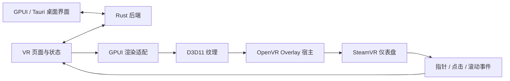

# SteamVR 内操作界面方案

日期：2026-10-07。目标是在头显内操作 SlimeVR，参考 OVR Advanced Settings 的 SteamVR 仪表盘入口和交互方式。本次范围已收敛为重置、骨架预览和节点信息，具体实现及验证状态见 [使用说明](rust-steamvr-dashboard.zh-CN.md)。

## 使用方式

已确认首先实现 SteamVR 仪表盘入口：用户按系统键打开仪表盘，选择 SlimeVR，用手柄射线点击界面。打开和关闭这个界面不暂停身体追踪。

游戏中常驻的悬浮面板或手腕面板可以沿用同一套连接和控件，留作后续扩展。本次范围为仪表盘入口。

首批界面包含：

- 完整重置、航向重置和安装方向重置；显示服务端倒计时和实际执行结果。
- 设备在线状态、电量、Wi-Fi 信号、需要校准的提示。
- 实时骨架预览，前 / 侧 / 顶视角、镜像、拖动旋转和滚动缩放。

桌面界面继续承担设置、分配和完整校准流程。VR 面板采用适合射线点击的按钮和字号，复用现有翻译、连接和投影数学。

## 当前可复用的部分

| 部分 | 现有位置 | 处理方式 |
| --- | --- | --- |
| SolarXR 连接、状态快照、事务和断联处理 | `gui-gpui/src/client.rs`、`protocol.rs`、`rpc_generated.rs` | 复用连接层，不新增后端协议 |
| Fluent 翻译及回退 | `gui-gpui/src/i18n.rs`、`locales.rs` | 继续使用原版文案 |
| 主题和受控设置组件 | `gui-gpui/src/ui/` | 复用逻辑，增加 VR 尺寸参数 |
| 电量、检查清单及分配逻辑 | `gui-gpui/src/battery.rs`、`checklist.rs`、`assignment.rs` | 复用状态计算，按页面需要抽取依赖 |
| OpenVR 头文件和示例 | `bindings-provider/openvr/` | 参考已固定版本的 Overlay 接口与事件处理 |
| Windows GPUI 渲染器 | `gui-gpui/vendor/gpui-pre-windows/` | 验证并增加纹理提交接口 |

`gui-gpui/src/overlay.rs` 目前只是原版 overlay 显示设置的 pub/sub 客户端，后端相关 RPC 负责保存显示与镜像偏好。它们不是 VR 渲染宿主，需要保留兼容边界。

GPUI Windows 渲染器目前围绕桌面窗口和交换链工作。其测试功能中的 `render_to_image` 会把 GPU 图像读回 CPU，不能据此认为已经具备适合生产使用的 Overlay 渲染接口。

## 进程和模块边界

第一版增加独立的 `slimevr-gpui-overlay` 可执行程序，入口位于 `gui-gpui/src/bin/overlay.rs`，OpenVR 会话和输入转换位于 `gui-gpui/overlay-runtime/`：

- Overlay 和桌面前端连接同一个后端，复用现有 SolarXR 协议；姿态解算仍由后端单独负责。
- 第一阶段 Overlay 连接已有后端。后端未运行时显示连接状态；后续如支持自动启动，应复用统一启动策略，避免重复启动服务。
- SteamVR 生命周期、纹理生命周期和输入转换放在 OpenVR 适配层；页面不直接调用 FFI。
- Overlay 退出不停止另一个进程启动的后端。SteamVR 退出或重启时释放旧句柄并重新建立 Overlay。
- 保留现有 bindings provider 的头显、手柄及快捷键职责；新 Overlay 使用独立应用标识，不复用它硬编码的上游 Steam 应用标识。

建议模块为 `openvr`（初始化和句柄）、`render`（纹理和设备恢复）、`input`（事件转换）、`model`（页面状态及 RPC）、`view`（VR 布局）。OpenVR 绑定方案在技术验证中确定，优先使用范围明确的 Rust FFI。

## 最先验证的技术问题

使用 `VRApplication_Overlay` 初始化 OpenVR，通过 `CreateDashboardOverlay` 创建主面板和缩略图。Windows 首选 D3D11 纹理，经 `SetOverlayTexture` 提交给 SteamVR。

先做一个包含按钮、计数器和滚动区域的技术样例，确认：

1. GPUI 能在没有可见桌面窗口时持续布局和绘制。可能需要隐藏宿主窗口或专用渲染目标，不能预先假定已有完整无窗口支持。
2. 纹理满足 SteamVR 要求，正确处理大小、格式、透明度、颜色空间、GPU 选择、对象生命周期和同步。
3. OpenVR 指针、按下、抬起、滚动事件能转换成 GPUI 输入；验证坐标方向、像素缩放、拖动、焦点和重复点击。
4. 图形设备丢失、SteamVR 重启及面板大小变化不会留下失效纹理或卡住渲染线程。

目标是让 GPUI 渲染出的纹理直接进入提交路径，避免逐帧 CPU 回读。CPU 图像上传最多作为短期诊断手段；如果 GPU 路径验证不通过，应先比较更小的渲染适配或其他 Rust 渲染方案，再决定是否继续扩展 GPUI。

## 实现顺序与验收

| 阶段 | 结果 | 验收条件 |
| --- | --- | --- |
| 1：渲染与输入验证 | SteamVR 仪表盘中的 GPUI 样例 | 能看到、点击、滚动；隐藏后不持续绘制；可退出和重启 |
| 2：接通 SlimeVR | 状态页和重置操作 | 与桌面状态一致；倒计时一致；断联后不重发重置操作 |
| 3：骨架与节点 | 实时骨架和追踪器遥测 | 显示真实后端数据；隐藏时关闭骨架订阅；断联后明确提示 |
| 4：分发集成 | 独立附加包、日志和桌面预览 | Windows 解压后可启动；退出面板不停止后端；已有驱动继续工作 |

如选择手腕或常驻面板，另增位置绑定、打开方式和游戏内交互验收。不会直接假定仪表盘的输入策略适用于常驻面板。

## 性能与测试

面板隐藏时停止提交新帧，降低遥测频率并关闭无用骨架订阅；显示时按变化和动画请求重绘。UI 帧率与后端解算频率独立，不能让 VR 界面工作阻塞追踪。

重点测试桌面与 VR 界面同时连接、快速开关面板、断联重连、SteamVR 重启、窗口缩放、不同手柄、不同系统缩放及多 GPU。验证重置请求只执行一次，不能在连接恢复后自动重发。

普通自动测试可以验证连接、状态、输入转换和操作语义。纹理提交、手柄命中、实际清晰度及满载表现必须在 Windows / SteamVR / 头显上验收；仅通过交叉编译不能证明 VR 界面可用。
