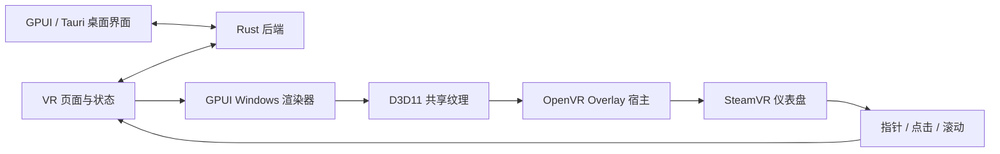

# SteamVR 仪表盘架构

独立程序 `slimevr-gpui-overlay` 提供完整 / 航向 / 安装方向重置、骨架预览与节点信息。用户按系统键打开 SteamVR 仪表盘后，通过手柄射线操作。使用与参数见 [面板说明](rust-steamvr-dashboard.zh-CN.md)。

## 模块边界

| 位置                                    | 职责                                             |
| --------------------------------------- | ------------------------------------------------ |
| `gui-gpui/src/bin/overlay.rs`           | 启动、界面状态、订阅、预览、大小与偏好同步       |
| `gui-gpui/src/dashboard.rs`             | 节点列表规则、宽度偏好和刷新节流                 |
| `gui-gpui/src/client.rs`、`protocol.rs` | 共用 SolarXR 连接、快照和操作结果                |
| `gui-gpui/overlay-runtime/`             | OpenVR 会话、FFI、纹理提交与指针输入转换         |
| `gui-gpui/vendor/gpui-pre-windows/`     | 隐藏宿主尺寸、D3D11 GPU copy、显卡选择和设备恢复 |
| `gui-gpui/src/overlay.rs`               | 原版显示 / 镜像设置的 pub/sub 客户端             |

桌面与 Overlay 连接同一后端。后台服务负责解算、校准和驱动输出；桌面负责分配、完整引导和设置；仪表盘提供常用操作。Overlay 退出释放自己的会话与纹理，后端继续按其启动方式运行。

## 纹理与输入

OpenVR 使用 `VRApplication_Overlay` 和 `CreateDashboardOverlay` 创建主面板与缩略图。Windows 渲染器将 GPUI 输出以 GPU copy 写入稳定共享 D3D11 纹理，由 UI 线程提交给 OpenVR。程序构建前选择 SteamVR compositor 的 DXGI adapter。

隐藏宿主在创建时应用客户区尺寸，异步帧请求推进布局与绘制。尺寸变化重新分配纹理，GPU 恢复释放旧资源。普通桌面窗口使用交换链显示。

OpenVR 的移动、按下、抬起和滚动转换为 GPUI 输入，坐标适配包含 Y 翻转与 DPI 缩放。中断的按压通过移出 UI 后释放来取消。UI 页面通过适配层使用这些事件。

## 连接与刷新

Overlay 连接已运行的后端，连接恢复重建读取和订阅。重置由当前会话中的点击触发，按钮按真实请求状态禁用，显示后端倒计时和完成状态。

面板显示时骨架订阅约 33ms、遥测约 100ms，状态重绘合并至约 30Hz。隐藏时停止纹理提交、关闭骨架订阅并把遥测间隔调整为 1000ms。SteamVR 退出后释放句柄并退出，重新启动时再打开附加程序。

右侧列表沿用桌面 GUI 的分组、卡片 / 表格、排序与开发显示，定期读取已有偏好文件。宽度设置保存在同一偏好文件的专用键中。桌面程序负责重置音效，通信线程将进度交给独立音频线程。

## 验证和扩展

自动检查覆盖输入转换、列表规则、订阅、重连、单次操作、宽度持久化和偏好合并。实际窗口检查布局、骨架交互与节点滚动；Windows / SteamVR / 头显验收检查纹理显示、手柄命中、多 GPU、清晰度、实时宽度与 CPU 竞争表现。

本程序采用手动启动的仪表盘入口。应用清单注册、SteamVR 自动启动、手腕面板与游戏中常驻面板属于后续独立功能，需要各自的位置绑定、输入和生命周期设计。
