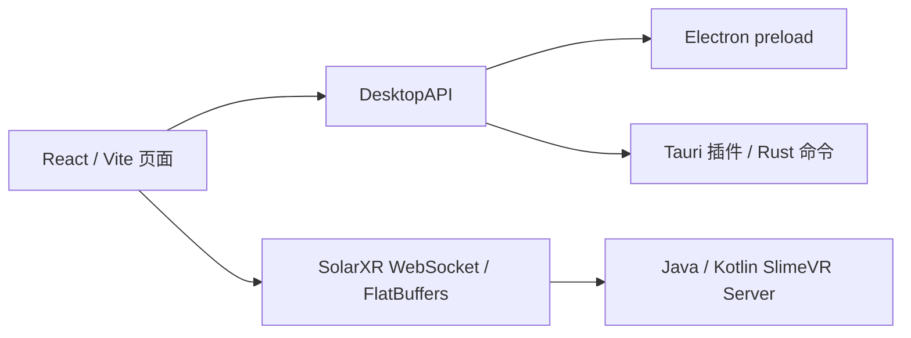

# SlimeVR 网页界面与 Tauri 运行指南

基于 SlimeVR-Server 提交 `83941fd38e91cc91ca6b360deab5c2ae986dd1b6`。本次将 React 页面对 Electron 的直接依赖集中到桌面适配层，并添加 Tauri 2 宿主。浏览器、Electron 和 Tauri 使用同一套页面；骨骼解算、AutoBone、追踪器通信可由新的 Rust 后端执行，也保留原来的 Java/Kotlin 服务启动方式。完整重写与集中验收见 [实施说明](../docs/rust-completion-worklog.zh-CN.md)。

Windows `Tauri-fix6-hand1` 包含手部追踪 / 手柄切换修复，使用与 GPUI 修复版相同的 Rust 后端，并重新构建生产网页及 Tauri 宿主。沿用 fix5 的日志分级、既有 SteamVR 驱动和配置。升级前完全退出旧界面和后端，避免新界面连接旧服务。详见 [手部切换修复说明](../docs/rust-steamvr-hand-handover.zh-CN.md)。

## 目录与边界

```text
gui/
├── src/                       React 页面、状态、SolarXR 客户端
│   ├── platform/
│   │   ├── types.ts           不依赖 Electron 类型的 DesktopAPI
│   │   ├── index.ts           检测浏览器 / Electron / Tauri
│   │   ├── tauri.ts           原生插件与 Rust invoke 的适配
│   │   └── drag.ts            Tauri 窗口拖动
│   └── hooks/desktop.ts       React 桌面上下文
├── public/                    图片、模型、字体、语言文件等静态资源
├── electron/                  原有 Electron 主进程与 preload
├── src-tauri/
│   ├── src/main.rs            原生窗口、托盘、单实例、退出清理
│   ├── src/server.rs          Java 检测、JAR 查找、子进程与日志事件
│   ├── src/presence.rs        Discord IPC 与活动更新
│   ├── src/commands.rs        日志、目录、平台、固件请求等命令
│   ├── src/paths.rs           配置与资源路径
│   ├── capabilities/main.json 原生权限
│   ├── tauri.conf.json        默认 GUI 构建
│   └── tauri.server.conf.json 可选：打包 Java 服务 JAR
└── tests/desktop.test.ts       桌面适配测试
```



React 源码不再导入 Electron 模块或 preload 类型。`window.electronAPI` 只在宿主检测处使用，Tauri 走自己的 IPC；浏览器使用 localStorage。前端与 Java 服务间默认仍是 `ws://localhost:21110`，没有新增协议或第二套解算实现。

当前仍将两个桌面宿主放在同一个 `gui` 工作区，以共用依赖和保留 Electron 构建。Tauri 的资源、入口和构建流程不需要 Electron 进程。

## 环境准备

- Node.js 与 pnpm **10.33.0**，版本以根目录 `package.json` 为准。
- Rust stable 工具链；安装方式见 [rustup](https://rustup.rs/)。
- [Tauri 2 系统依赖](https://v2.tauri.app/start/prerequisites/)：Windows 需要 Visual Studio C++ Build Tools 与 WebView2；macOS 需要 Xcode Command Line Tools；Linux 需要 GTK 3、WebKitGTK 4.1 和托盘开发库。
- 使用 Java 服务时需要 Java **17 或以上**；仅构建和启动 GUI 不需要 Java。

Debian/Ubuntu 系统依赖示例：

```bash
sudo apt install build-essential pkg-config libwebkit2gtk-4.1-dev \
  libgtk-3-dev libayatana-appindicator3-dev librsvg2-dev patchelf
```

在仓库根目录初始化协议子模块并安装：

```bash
git submodule update --init --recursive
corepack enable
pnpm install --frozen-lockfile
```

`prepare` 会编译 SolarXR TypeScript 协议。若只使用浏览器/Tauri，可在安装依赖前设置 `ELECTRON_SKIP_BINARY_DOWNLOAD=1`，省去 Electron 可执行文件下载；共享工作区中的 Electron 依赖仍保留。已有依赖时不用重复安装。

## Rust 后端与完整桌面包

```bash
# 从仓库根目录执行；构建 Rust 后端、原版 OpenVR helper 并启动 Tauri
pnpm tauri:rust:dev

# 为当前主机操作系统生成安装包
pnpm tauri:rust:build
```

OpenVR helper 构建需要 CMake 3.26+ 和 C++23 编译器；Windows 使用 Visual Studio 2022，Linux 建议 GCC 14+。macOS 不提供 SteamVR 桌面桥接，继续支持浏览器／OSC／VMC 工作流。无需 Java 即可运行 Rust 模式。

更新检查沿用原版的 GitHub release 提示和手动下载安装。Rust/Tauri 构建可设置 `VITE_RELEASE_REPOSITORY=owner/repo`，未设置时关闭该宿主的版本检查，避免引导安装原版 Java 安装包；可用 `VITE_DESKTOP_VERSION` 设置前端比较版本。

## 运行网页或 Tauri

以下命令从仓库根目录执行。

```bash
# 浏览器版本：http://127.0.0.1:5173
pnpm web

# Tauri 开发窗口，自动启动 Vite
pnpm tauri:dev

# 原来的 Electron 开发窗口
pnpm gui
```

GUI 未连接 Java 服务时会显示连接中或连接失败页面。页面加载成功并不表示已经有追踪数据。

### 连接已有服务

先启动现有 SlimeVR Server，再启动 Tauri。默认宿主发现本机 `21110` 端口已占用时跳过 Java 启动；这是端口检查，不会验证占用进程的身份。也可以明确只运行 GUI：

```bash
pnpm --dir gui exec tauri dev -- -- --no-server
```

Tauri CLI 在第二个 `--` 后才将参数传给应用。直接调用 GUI 子命令时，先确保执行过 `pnpm update-solarxr`，`pnpm install` 已经包含这一步。

浏览器可用 `http://127.0.0.1:5173/?ip=192.168.1.10&port=21110` 指定远程服务，参数沿用原来的 WebSocket 客户端逻辑。远程连接需要自行保证服务可达。

### 由 Tauri 启动 Java 服务

可以指定已有安装中的 JAR 和 Java：

```bash
pnpm --dir gui exec tauri dev -- -- --server-jar /absolute/path/slimevr.jar
pnpm --dir gui exec tauri dev -- -- --server-jar /absolute/path/slimevr.jar --java-path /absolute/path/java
```

Windows 可使用对应的绝对路径；带空格的路径加双引号。应用参数如下：

| 参数                        | 行为                                            |
| --------------------------- | ----------------------------------------------- |
| `--no-server`               | 只连接服务，不启动 Java                         |
| `--server-jar <file>`       | 指定 Java 服务 JAR                              |
| `--path <directory>` / `-p` | 指定含 `slimevr.jar` 的目录，兼容 Electron 用法 |
| `--java-path <file>`        | 指定 Java 可执行文件，并检查版本                |
| `--steam` / `-s`            | 传给 Java 服务并启用 GUI 的 Steam 模式标识      |
| `--install` / `-i`          | 传给 Java 服务                                  |
| `--no-udev`                 | 传给 Java 服务                                  |

未指定 JAR 时，宿主查找打包资源目录、可执行文件旁的 `slimevr.jar` 以及 Linux 常见安装目录。开发/调试构建额外查找 `server/desktop/build/libs/slimevr.jar`。

Java 查找顺序为：指定的路径、JAR 旁/资源目录中的 `jre`、`JAVA_HOME`、系统 JVM 安装目录、`PATH`。调用前执行 `java -version`，要求版本 ≥ 17。Java 运行命令为 `java -Xmx128M -jar <jar> [flags] run`，工作目录为 JAR 所在目录。

GUI 会转发 Java stdout/stderr 和启动失败事件，并保存有限的事件历史，避免页面加载较晚时丢失启动错误。关闭应用会停止**本次由该宿主启动**的子进程；已经在其他地方运行的服务由原启动方式管理。

## 打包

```bash
# 默认安装包：GUI、静态资源、udev 规则和官方 SteamVR 驱动；不包含 Java 服务/JRE
pnpm tauri:build

# 快速检查本机可执行文件，跳过安装包生成
pnpm --dir gui exec tauri build --debug --no-bundle
```

输出在 `gui/src-tauri/target/release/`，安装包在其 `bundle/` 子目录；`--debug` 输出在 `target/debug/`。请在目标操作系统上构建安装包。

需要把 Java 服务 JAR 一并装入安装包时，先在仓库根目录编译服务，再启用可选配置：

```bash
./gradlew :server:desktop:shadowJar
pnpm --dir gui exec tauri build --config src-tauri/tauri.server.conf.json
```

Windows 使用 `gradlew.bat :server:desktop:shadowJar`。该配置将编译结果映射成资源目录中的 `slimevr.jar`，宿主会自动发现它。它仍然**不包含 JRE 和完整 SlimeVR 安装器的其他组件**。分发时可要求用户安装 Java 17+，或提供平台对应的 JRE 并通过额外资源配置映射到 `jre/`；Tauri 打包的 JRE 文件权限及签名需要在目标系统验证。

## 功能与持久化

| 功能                                    | 浏览器           | Electron     | Tauri                  |
| --------------------------------------- | ---------------- | ------------ | ---------------------- |
| React 页面、SolarXR 数据、3D 预览       | 支持             | 支持         | 支持                   |
| 设置与缓存                              | localStorage     | 原有文件存储 | Tauri store 文件       |
| 最小化、最大化、关闭、窗口拖动          | 无桌面窗口接口   | 支持         | 支持                   |
| 托盘显示/隐藏/退出                      | 无               | 原有行为     | 支持                   |
| 文件/目录选择、BVH 保存位置             | 受浏览器能力限制 | 支持         | 原生对话框             |
| Java 服务子进程与日志                   | 手动运行服务     | 原有行为     | 支持                   |
| 外链打开、配置/日志目录、固件元数据请求 | 受浏览器能力限制 | 支持         | 支持                   |
| Discord Rich Presence                   | 无               | 支持         | 支持 Discord IPC，含更新／禁用／重连 |

Tauri 托盘菜单暂时使用英文固定标签。窗口大小/位置由 window-state 插件保存。GUI 设置和缓存分别为 `gui-settings.dat`、`gui-cache.dat`，保留原有文件名、JSON 数据格式和应用标识 `dev.slimevr.SlimeVR`：

| 系统    | Tauri GUI 数据目录                                              | Java 服务配置目录                                            |
| ------- | --------------------------------------------------------------- | ------------------------------------------------------------ |
| Windows | `%APPDATA%/dev.slimevr.SlimeVR`                                 | `%APPDATA%/dev.slimevr.SlimeVR`                              |
| macOS   | `~/Library/Application Support/dev.slimevr.SlimeVR`             | 同左                                                         |
| Linux   | `$XDG_DATA_HOME/dev.slimevr.SlimeVR`，默认 `~/.local/share/...` | `$XDG_CONFIG_HOME/dev.slimevr.SlimeVR`，默认 `~/.config/...` |

路径以 Tauri 系统目录 API 和 Java 服务配置规则为准。GUI 数据目录与原 Electron 的 `getGuiDataFolder()` 对齐，可沿用已有 GUI 设置；不要同时用两个宿主写同一份文件。窗口位置改由 Tauri 插件管理，不自动迁移 Electron 的窗口状态。GUI 日志位于 GUI 数据目录的 `logs/gui-tauri.log`；“打开配置文件夹”指向 Java 服务配置目录，`override.ftl` 也从该目录加载。

另修复了文件选择始终使用目录模式、取消 BVH 保存仍发送录制请求的问题，以及桌面分支中条件调用 React hooks 的问题。

## 验证

```bash
pnpm --dir gui lint
pnpm --dir gui test:desktop
pnpm --dir gui web:build
pnpm --dir gui build
cd gui/src-tauri
cargo fmt --check
cargo test
```

适配测试使用 Tauri 官方 IPC mock，覆盖浏览器回退、Electron 桥接复用、Tauri 检测、原生文件/目录选择及取消、设置/缓存隔离与保存、异步事件监听清理。Rust 测试覆盖 Java 版本解析及固件资源 URL 范围。

分配页连接回归测试：先编译 Rust 后端，再运行 `pnpm --dir gui test:assignment-browser`。该命令构建生产网页，随后自动启动测试后端和网页预览，使用 Chromium / Chrome / Edge 检查实际页面导航、设置更新与断线恢复。浏览器由系统提供；可通过 `SLIMEVR_BROWSER_EXECUTABLE` 指定路径，通过 `SLIMEVR_RUST_BINARY` 指定后端。未检测到浏览器时测试会跳过，请确认测试结果包含通过项。

本次验证记录（2026-10-03）：

- TypeScript、ESLint、Prettier 检查通过；5 项桌面适配测试和 2 项 Rust 测试通过。
- Vite 网页、原 Electron 构建以及 Linux `tauri build --debug --no-bundle` 通过。
- Chromium 加载网页无未捕获异常；Linux Tauri 在 Xvfb 中实际显示连接失败页和欢迎页，设置/缓存文件与 GUI 原生日志正常生成。
- Tauri 连接本地测试 WebSocket，发出 SolarXR 二进制消息；该测试没有模拟完整 SlimeVR 服务响应。
- 用 Java 21 运行一个测试 JAR，验证原生宿主启动 Java、传入 `run`、转发 stdout/stderr；点击应用退出后，Java 子进程被回收。该 JAR 是生命周期测试夹具，未替代真实 SlimeVR 服务。
- Windows GNU 目标的 `cargo check --target x86_64-pc-windows-gnu` 通过；Windows/macOS 原生运行及安装包未在本环境验证。

追踪器、VR 运行时和固件刷写仍需连接相应设备做端到端测试。

## Rust 后端

现在可执行仓库根目录的 `pnpm tauri:rust`，由 Tauri 自动启动 Rust 后端。配置保存、支持的 SolarXR 操作与各平台资源打包方式见 [前后端联调说明](../docs/rust-frontend-integration.zh-CN.md)。旧版本文中“Java 启动”的说明适用于 `--backend java`，默认 `auto` 会优先查找 Rust 后端。

Rust 直接读取并写回原版 `vrconfig.yml` / `.yaml`，默认位于应用的服务目录。可用 `--config <路径>` 指向已有配置；字段和迁移范围见 [配置兼容说明](../docs/rust-config-compatibility.zh-CN.md)。

Linux/Windows 的 Rust 后端默认启动 SteamVR 协议 2 桥，复用已有 OpenVR Driver。辅助程序和参数见 [SteamVR 桥接说明](../docs/rust-steamvr-bridge.zh-CN.md)。

## SteamVR 驱动资源

`pnpm tauri:dev`、`pnpm tauri:build` 和根目录 `pnpm tauri:rust` 会准备官方 v6.0.0 的 Windows x64／Linux x64、aarch64 驱动资源，包含固定下载哈希和许可证。需要 Python 3，首次下载需网络。直接调用 `tauri dev/build` 前先执行 `pnpm --dir gui tauri:drivers`。Rust 自动查找 SteamVR 并注册未安装驱动，现有注册保持不变；前端沿用原启用流程。资源不含 Bindings Provider，仍使用已有安装或 `--bindings-provider` 指定路径。

日常 AutoBone 文件、敲击分配、磁力计控制、驱动管理和实测边界见 [实施说明](../docs/rust-daily-workflow.zh-CN.md)。

## 日志分级

默认 `info`，支持 `--log-level debug` / `trace` 和环境变量 `SLIMEVR_LOG_LEVEL`。同一级别用于前端、原生宿主和它启动的 Rust 后端；日志过滤在序列化和 IPC 前执行。`logs/gui-tauri.log` 每约 10 MiB 轮转，最多保留四份历史文件。便携包提供 `Start-SlimeVR-Debug.cmd`，启动前需要完全退出已有实例。日志含真实级别、来源及毫秒时间，进程状态只落盘一次。详细级别、命令行兼容和收集步骤见 [日志说明](../docs/rust-logging.zh-CN.md)。
